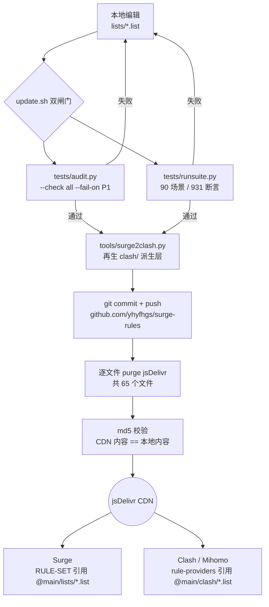

# surge-rules

个人维护的 Surge 分流规则集,以及由它自动派生的 Clash (Mihomo) 规则集 —— 一套编辑源、两端消费,经全局唯一化去重与冲突消解,全链路零本地 DNS 解析。

规则本地化自 skk.moe / Repcz / Loyalsoldier / blackmatrix7 等上游来源。`lists/` 下的 32 个 Surge `.list` 是**唯一编辑源**;`clash/` 下的同名文件由 [`tools/surge2clash.py`](tools/surge2clash.py) 全量再生,**禁止手工编辑**。

---

## 分发链架构



各环节职责详见 [docs/ARCHITECTURE.md](docs/ARCHITECTURE.md)。

---

## 目录结构

```
rules/                        # git 仓库根(公开仓库)
├── README.md                 # 本文件:总览、架构图、目录导航、快速开始
├── CHANGELOG.md              # 更新记录(Keep a Changelog 风格,倒序)
├── update.sh                 # 发布入口:双闸门 → clash 再生 → commit/push → purge → md5
├── .gitignore                # 忽略 __pycache__/、*.pyc、reference/
├── lists/                    # ★ 32 个 Surge .list —— 唯一编辑源
├── modules/                  # Surge 模块 .sgmodule
│   ├── README.md             # 目录约定与入库标准
│   └── _template.sgmodule    # 新模块起手模板
├── scripts/                  # Surge JS 脚本
│   ├── README.md             # 目录约定与入库标准
│   └── _template.js          # 新脚本起手模板
├── clash/                    # 派生层:32 个同名 .list + rule-providers.yaml(勿手编)
├── tools/
│   └── surge2clash.py        # Surge → Clash(Mihomo)转换器
├── tests/                    # 离线测试四件套
│   ├── engine.py             # 离线规则引擎(只读解析 Surge.conf 与 lists/)
│   ├── audit.py              # 静态审计(A1–A6)
│   ├── runsuite.py           # 场景回归:90 场景 / 931 断言(含 351 条 DNS 泄漏断言)
│   ├── live_check.py         # 在线核对(需 conf 开启 http-api)
│   ├── allowlist.json        # 审计豁免白名单(既定裁决的落点)
│   └── scenarios/*.json      # 场景定义
├── docs/
│   ├── ARCHITECTURE.md       # 架构与设计裁决
│   ├── MAINTENANCE.md        # 日常维护与发布手册
│   └── DEVELOPMENT.md        # module / script 开发指南
└── reference/                # 本地参考库(gitignored,不入库)
```

> `reference/` 存放上游参考项目与官方文档抓取,仅供本地查阅,已在 `.gitignore` 中,**绝不 `git add`**。

---

## 32 个 list 总览

下表按 Surge.conf `[Rule]` 段的实际规则序(0–8 九个区块)组织 —— **表格自上而下的顺序就是匹配优先级**。区的划分原理与排序依据见 [docs/ARCHITECTURE.md](docs/ARCHITECTURE.md)。

| 区 | list | 策略去向 | 职责 |
|---|---|---|---|
| 0 系统/内网/校园网 | PrivateLAN | DIRECT | 内网与本地域名,先于一切代理规则 |
| 0 系统/内网/校园网 | PKU | DIRECT | 校园网域名直连 |
| 1 广告拦截 | Reject | REJECT(当前注释停用) | 广告/追踪/劫持拦截精简版 |
| 2 国服游戏下载 | GameDownloadCN | DIRECT | 国服游戏下载 CDN,须先于 Games / DownloadCDN |
| 3 YouTube | YouTube | 流媒体 | YouTube / YouTube Music 全量,须先于 Google |
| 4 生态分类 | Google | Google-X-Meta-MS | Google 生态(含 Gemini),须先于 AI |
| 4 生态分类 | Twitter | Google-X-Meta-MS | X / Twitter 生态(含 Grok),须先于 AI |
| 4 生态分类 | Meta | Google-X-Meta-MS | Meta 生态(含 Meta AI),须先于 AI |
| 4 生态分类 | Microsoft | Google-X-Meta-MS | Copilot / Bing / MSN / 国际登录面,共 25 条 |
| 4 生态分类 | AI | AI 组 | 独立 AI 服务商 + GitHub 全生态 + 国内厂商国际站;以 extended-matching 引用 |
| 4 生态分类 | TikTok | 社交媒体 | TikTok 生态 |
| 4 生态分类 | SocialOthers | 社交媒体 | 其余社交平台 |
| 4 生态分类 | Telegram | Telegram(独立组) | Telegram 域名与 IP,单独成组便于独立选线 |
| 4 生态分类 | Streaming | 流媒体 | 境外流媒体服务 |
| 4 生态分类 | Games | 游戏 | 国际游戏平台与对战服务 |
| 4 生态分类 | DownloadCDN | 下载 | 大流量批量下载域(定位已收窄,非站点静态资源) |
| 5 Apple/微软国内 | AppleCN | DIRECT | Apple 国内可直连面,先于 GFW 防抢跑 |
| 5 Apple/微软国内 | MicrosoftCN | DIRECT | 微软国内可直连面,先于 GFW 防抢跑 |
| 6 GFW 兜底 | ProxyGFW | Final | 被墙域名兜底(含 `DOMAIN-SUFFIX,amazonaws.com` 的刻意 AWS 兜底) |
| 7 地区表 | Japan | 日本节点组 | 日本地区域名 + GEOIP/IP-ASN,同表自包含 |
| 7 地区表 | UK | 英国节点组 | 英国地区域名 + GEOIP/IP-ASN,同表自包含 |
| 7 地区表 | Europe | 欧洲节点组 | 欧洲地区域名 + GEOIP/IP-ASN,同表自包含 |
| 7 地区表 | US | 美国节点组 | 美国地区域名 + GEOIP/IP-ASN,同表自包含 |
| 8 国内直连 | Domestic | DIRECT | 手工杂项层,国内区最高优先(第一层) |
| 8 国内直连 | ChinaMedia | DIRECT | 国内媒体与其 CDN(第二层) |
| 8 国内直连 | TencentCN | DIRECT | 腾讯生态国内域名(第二层) |
| 8 国内直连 | AlibabaCN | DIRECT | 阿里生态国内域名(第二层) |
| 8 国内直连 | ByteDanceCN | DIRECT | 字节生态国内域名(第二层) |
| 8 国内直连 | BaiduCN | DIRECT | 百度生态国内域名(第二层) |
| 8 国内直连 | NetEaseCN | DIRECT | 网易生态国内域名(第二层) |
| 8 国内直连 | ChinaDomain | DIRECT | 约 10.6 万条国内域名长尾兜底(第三层,机器管理,**手工条目勿加**) |
| 8 国内直连 | ChinaIP | DIRECT(`no-resolve`) | 国内 IP 段 |

表外还有 conf 内建规则(非本仓库 list):区 0 开头的 `RULE-SET,SYSTEM,DIRECT`(Surge 内建系统规则集);区 8 尾部的收尾链 `RULE-SET,LAN`(`no-resolve`)→ `GEOIP,CN`(`no-resolve`)→ `FINAL,Final,dns-failed`。

**两条不变量**:每个域名/IP 在全链中**唯一归属**一个 list(按 conf 顺序级联去重);所有 IP 类规则一律带 `no-resolve`。

---

## 快速开始

### Surge

在 `[Rule]` 段按上表顺序引用远程 RULE-SET:

```
# 域名类
RULE-SET,https://cdn.jsdelivr.net/gh/yhyfhgs/surge-rules@main/lists/GameDownloadCN.list,DIRECT
RULE-SET,https://cdn.jsdelivr.net/gh/yhyfhgs/surge-rules@main/lists/YouTube.list,流媒体
RULE-SET,https://cdn.jsdelivr.net/gh/yhyfhgs/surge-rules@main/lists/AI.list,AI,extended-matching

# IP 类:必须带 no-resolve
RULE-SET,https://cdn.jsdelivr.net/gh/yhyfhgs/surge-rules@main/lists/ChinaIP.list,DIRECT,no-resolve
```

URL 模板:`https://cdn.jsdelivr.net/gh/yhyfhgs/surge-rules@main/lists/<Name>.list`

### Clash (Verge Rev / Mihomo)

```yaml
rule-providers:
  YouTube:
    type: http
    behavior: classical
    format: text
    url: "https://cdn.jsdelivr.net/gh/yhyfhgs/surge-rules@main/clash/YouTube.list"
    path: ./ruleset/YouTube.list
    interval: 86400        # 自行设定刷新周期

rules:
  - RULE-SET,YouTube,流媒体
```

URL 模板:`https://cdn.jsdelivr.net/gh/yhyfhgs/surge-rules@main/clash/<Name>.list`

[`clash/rule-providers.yaml`](clash/rule-providers.yaml) 已提供全部 32 个 provider 的定义与按优先级排好序的 `rules` 参考序列,可在 Clash Verge Rev 的「Merge」扩展中直接取用,无需手抄。

---

## 维护流程摘要

三步走,细节见 [docs/MAINTENANCE.md](docs/MAINTENANCE.md):

1. **改** —— 只改 `lists/` 下的 Surge `.list`。先按 8 区定位区,再按国内三层定位层;保证全链唯一归属;IP 规则必带 `no-resolve`。
2. **测** —— `python3 tests/runsuite.py` 跑场景回归;必要时 `python3 tests/audit.py --check all` 看静态审计详情。
3. **发** —— `./update.sh "<commit message>"`。脚本自带双闸门(audit `--fail-on P1` + runsuite),通过后才再生 `clash/`、commit、push、逐文件 purge jsDelivr、md5 校验。闸门不过即中止,不会发出半成品。

---

## 文档导航

| 文档 | 内容 |
|---|---|
| [docs/ARCHITECTURE.md](docs/ARCHITECTURE.md) | 分发链全图、`[Rule]` 8 区规则序与排序原理、国内直连三层、零本地 DNS 解析约束、Clash 派生层设计、设计裁决记录、测试体系设计 |
| [docs/MAINTENANCE.md](docs/MAINTENANCE.md) | 新增规则的归属决策树、本地验证、发布流程逐步拆解、生效方式、故障排查、红线清单、备份与回滚 |
| [docs/DEVELOPMENT.md](docs/DEVELOPMENT.md) | module / script 开发指南:能力路线图、sgmodule 格式、脚本类型与核心 API、MitM 与 hostname 纪律、本地调试流、参考项目导读 |
| [modules/README.md](modules/README.md) | `modules/` 目录约定与入库标准 |
| [scripts/README.md](scripts/README.md) | `scripts/` 目录约定与入库标准 |
| [CHANGELOG.md](CHANGELOG.md) | 版本更新记录 |
