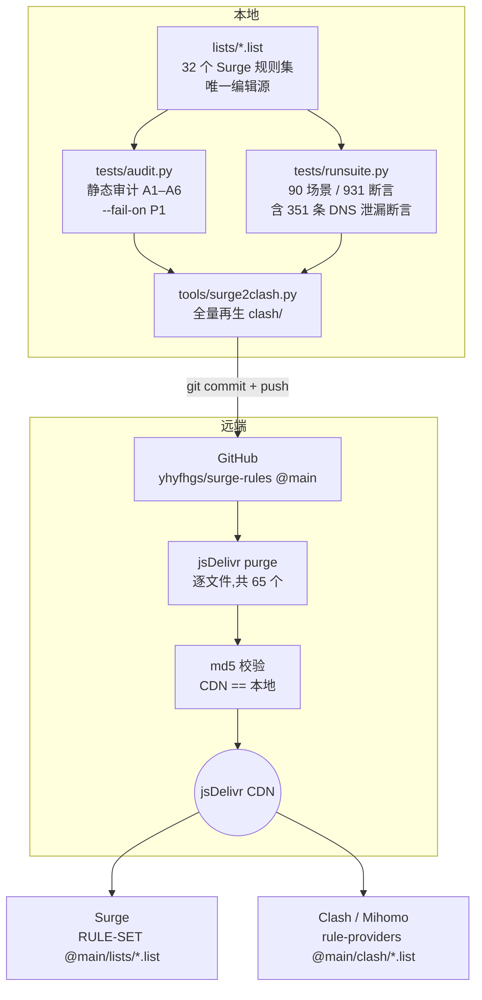
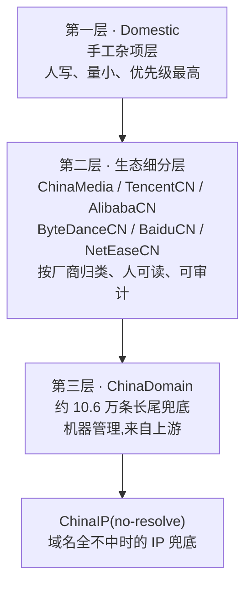
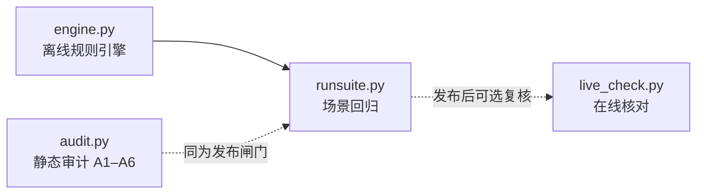

# 架构设计

本文档说明 surge-rules 的分发链、规则序设计、核心约束、派生层机制、既定设计裁决与测试体系。
日常操作步骤见 [MAINTENANCE.md](MAINTENANCE.md);module / script 开发见 [DEVELOPMENT.md](DEVELOPMENT.md);仓库总览见 [../README.md](../README.md)。

---

## 1. 分发链

### 1.1 全图



### 1.2 各环节职责

| 环节 | 位置 | 职责 | 不做什么 |
|---|---|---|---|
| 编辑源 | `lists/*.list` | 唯一手工编辑入口。所有规则变更从这里开始 | 不生成、不派生任何东西 |
| 静态闸门 | `tests/audit.py` | 结构性审计(A1–A6),`--fail-on P1` 时 P1 级问题直接阻断发布 | 不模拟真实请求 |
| 场景闸门 | `tests/runsuite.py` | 用离线引擎跑 90 个真实场景,校验落点策略与 DNS 行为 | 不联网、不依赖运行中的 Surge |
| 派生 | `tools/surge2clash.py` | 由 `lists/` 全量再生 `clash/` 与 `rule-providers.yaml` | 不做增量更新,不容忍未知规则类型 |
| 发布 | `update.sh` | 串起闸门→派生→commit→push→purge→md5 的全流程 | 闸门未过一律中止,不发半成品 |
| CDN | jsDelivr | 边缘缓存分发 | 不主动感知 GitHub 更新,必须显式 purge |
| 消费端 | Surge / Clash | 按远程 URL 拉取并按 conf 中的顺序匹配 | 不做本地二次加工 |

**为什么必须显式 purge**:jsDelivr 对 `@main` 分支路径有边缘缓存,push 之后 CDN 不会立刻反映新内容。`update.sh` 逐文件调用 purge 接口,再用 md5 逐文件比对 CDN 返回与本地文件,确认一致才算发布成功。这是"改了但没生效"这类幽灵问题的根治手段。

---

## 2. Surge.conf `[Rule]` 规则序(0–8 九区)

Surge 的 `[Rule]` 段是**自上而下首次命中即停**。因此规则序就是优先级,一个域名的最终去向完全取决于哪张表先碰到它。下表是完整规则序,以及每一区**为什么必须在这个位置**。

| 区 | 内容 | 去向 | 为什么在这个位置 |
|---|---|---|---|
| **0** | `SYSTEM`、PrivateLAN、PKU | DIRECT | 系统流量、内网域名、校园网必须先于一切分流。任何代理规则抢先命中都会破坏本机服务与内网可达性 |
| **1** | Reject | REJECT(当前**注释停用**) | 拦截语义天然优先于分流:该丢弃的连接不应先被分配策略再丢弃 |
| **2** | GameDownloadCN | DIRECT | **须先于 Games / DownloadCDN**。国服游戏下载 CDN 与国际游戏平台、通用下载域高度重叠,不抢先命中就会被拉去走代理,把大流量下载塞进代理链路 |
| **3** | YouTube | 流媒体 | **须先于 Google**。YouTube 域名属于 Google 生态,若 Google 表先命中,YouTube 会被归到 Google-X-Meta-MS 组而非流媒体组,解锁与线路选择全错位 |
| **4** | Google / Twitter / Meta / Microsoft | Google-X-Meta-MS | 生态归属优先于服务分类。**须先于 AI** —— Gemini 属 Google、Grok 属 Twitter、Meta AI 属 Meta,若 AI 表先命中会把它们从各自生态里剥走 |
| **4** | AI(`extended-matching`) | AI 组 | 三大生态与 Microsoft 之后。独立 AI 服务商 + GitHub 全生态 + 国内厂商国际站。`extended-matching` 让规则同时匹配 SNI 等扩展信息,提升命中率 |
| **4** | TikTok / SocialOthers | 社交媒体 | 生态表之后的服务分类层 |
| **4** | Telegram | Telegram(独立组) | 服务分类层;单独成组便于独立选线 |
| **4** | Streaming | 流媒体 | 同上;YouTube 已在区 3 单独提前 |
| **4** | Games | 游戏 | GameDownloadCN(区 2)之后,国服下载已被摘走 |
| **4** | DownloadCDN | 下载 | 分类层最后。定位是「大流量批量下载域」,不是站点静态资源 |
| **5** | AppleCN / MicrosoftCN | DIRECT | **先于 GFW 防抢跑**。ProxyGFW 中的宽泛后缀/关键词可能吃掉 Apple、微软的国内可直连面,导致本可直连的国内 CDN 被推去走代理 |
| **6** | ProxyGFW | Final | 被墙域名的兜底表。放在生态表与 Apple/微软之后,只捡前面没人认领的被墙域 |
| **7** | Japan / UK / Europe / US | 对应地区节点组 | **域名 + GEOIP/IP-ASN 同表自包含**,整体置于 Apple/微软/GFW **之后**、国内区**之前**。之后:地区表自带的 GEOIP 会遮蔽 Apple 17/8 与 ProxyGFW 的 IP 规则,前置就会抢跑;之前:地区表是明确归属,必须先于国内长尾兜底(ChinaDomain)与 `GEOIP,CN` 兜底命中 |
| **8** | Domestic | DIRECT | 国内直连第一层,手工杂项,国内区内最高优先 |
| **8** | ChinaMedia / TencentCN / AlibabaCN / ByteDanceCN / BaiduCN / NetEaseCN | DIRECT | 国内直连第二层,厂商生态细分 |
| **8** | ChinaDomain | DIRECT | 国内直连第三层,约 10.6 万条长尾兜底 |
| **8** | ChinaIP(`no-resolve`) | DIRECT | 域名全不命中后,按目的 IP 直连 |
| — | `RULE-SET,LAN`(`no-resolve`) | — | conf 内建收尾 |
| — | `GEOIP,CN`(`no-resolve`) | — | conf 内建收尾,ChinaIP 的补充近似 |
| — | `FINAL,Final,dns-failed` | Final | 全不命中 → 交远端解析(见 §4) |

### 一条口诀

> **越精确越靠前,越兜底越靠后;拦截 > 直连特例 > 生态 > 分类 > 被墙兜底 > 地区 > 国内三层 > FINAL。**

---

## 3. 国内直连三层设计

国内直连区(区 8)不是一张大表,而是**三层职责分明的表**,自上而下优先级递减:



| 层 | 表 | 定位 | 谁维护 | 变更频率 |
|---|---|---|---|---|
| 一 | Domestic | 手工杂项:临时补丁、上游没覆盖的域、需要立刻生效的特例 | 人工逐条 | 高 |
| 二 | ChinaMedia / TencentCN / AlibabaCN / ByteDanceCN / BaiduCN / NetEaseCN | 大厂生态按主体归类,便于按厂商审阅与整体调整 | 人工 + 上游对齐 | 中 |
| 三 | ChinaDomain | 国内域名长尾兜底,约 10.6 万条 | **机器管理**,随上游整体替换 | 低(整表刷新) |

### 「手工条目勿加 ChinaDomain」

ChinaDomain 是**整表机器替换**的层。往里面手写条目,下一次上游同步就会被无声抹掉,而且因为体量太大,没人会发现少了什么。

规矩很简单:

- **要立刻生效、临时性的** → 写进 Domestic(第一层)。
- **属于某个大厂生态的** → 写进对应的厂商细分表(第二层)。
- **ChinaDomain** → 只能整表刷新,永远不手工编辑单条。

三层之间同样遵守**唯一归属**:一个域名在 Domestic 出现过,就不该再出现在厂商表或 ChinaDomain 里。级联去重的执行方式见 [MAINTENANCE.md](MAINTENANCE.md)。

---

## 4. 核心约束:全链路零本地 DNS 解析

这是整套规则最重要、也最容易被"好心修复"破坏的设计。

### 4.1 规则

> **所有 IP 类规则(`IP-CIDR` / `IP-CIDR6` / `GEOIP` / `IP-ASN`)必须带 `no-resolve`。任何合并、任何上游同步,都不得引入无 `no-resolve` 的 IP 规则。**

### 4.2 原理

Surge 匹配一条 IP 类规则时,如果连接的目标是**域名**而不是字面 IP,它必须先把域名解析成 IP 才能比较。没有 `no-resolve`,这个解析就在**本地**发生,后果有三:

1. **DNS 泄漏** —— 本该由远端代理解析的域名,查询包从本机发了出去。这既暴露了访问意图,也在被污染的解析路径上拿回错误结果。
2. **延迟惩罚** —— 每条无 `no-resolve` 的 IP 规则,都可能在匹配阶段触发一次阻塞式解析。规则表越长,惩罚越重。
3. **错误分流** —— 污染或 CDN 就近解析返回的 IP,和真实目标可能落在完全不同的地理区间,GEOIP 判定随之出错。

加上 `no-resolve` 后,IP 类规则**只对已经携带字面 IP 的连接生效**,域名连接直接跳过继续往下匹配。

### 4.3 未命中域名怎么办

规则序末尾是 `FINAL,Final,dns-failed`。

- 所有域名规则都不命中的域名,**不在本地解析**,直接按 FINAL 交给 `Final` 策略组,**由远端出口完成解析**。这正是"零本地 DNS 解析"闭环的收口。
- `dns-failed` 参数覆盖另一种情形:本地 DNS 解析确实失败的连接同样兜到 FINAL,交远端处理,而不是直接失败。

### 4.4 为什么这条约束需要 351 条断言守着

`runsuite.py` 的 931 条断言里有 **351 条专门是 DNS 泄漏断言**。原因是这条约束的破坏方式极其隐蔽:上游同步一批 IP 段、有人"顺手"给某条 GEOIP 去掉 `no-resolve` 想"修一个不生效的规则",分流表面看还是对的,泄漏却已经发生。只有把它变成会打红的断言,才守得住。

---

## 5. Clash 派生层设计

### 5.1 单一编辑源原则

```
lists/*.list  ──(tools/surge2clash.py 全量再生)──▶  clash/*.list + clash/rule-providers.yaml
   ▲                                                         ▲
唯一手工编辑入口                                    纯派生产物,禁止手工编辑
```

任何在 `clash/` 里的手改都会在下一次 `update.sh` 被覆盖,而且不会有任何提示。要改 Clash 端的行为,只能改 `lists/` 或改转换器。

### 5.2 转换约定

| Surge 侧 | Clash 侧 | 说明 |
|---|---|---|
| `DOMAIN-WILDCARD` | `DOMAIN-REGEX` | 按 Surge 通配语义转写:`*` → `.*`、`?` → `.`,并加 `^` `$` 锚定,避免正则退化成子串匹配 |
| `USER-AGENT` | (剔除) | Clash 无 UA 匹配层。剔除数量记在目标文件头 |
| `URL-REGEX` | (剔除) | Clash 无 URL 匹配层。剔除数量记在目标文件头 |
| 其余类型(含 `no-resolve`) | 原样透传 | `no-resolve` 语义两端一致,必须保留 |
| 未知类型 | **fail-fast** | 转换器中止,发布随之中止。宁可不发,不做静默降级 |

因为 UA / URL 两层被剔除,**Clash 端的分流精度必然略低于 Surge 端**。这是引擎能力差异,不是 bug;文件头的计数就是这份差额的账本。

### 5.3 138,185 条守恒验证

派生层的正确性基线是:**mihomo 1.19.20 实载后规则总数守恒于 138,185 条**。

验证时有两个坑:

1. `mihomo -t`(配置测试)是**懒加载**,不会真正拉取和解析 rule-provider 的内容,数出来的数字没有意义。必须**真正启动**,再查 API 的 `ruleCount`。
2. provider 是**异步初始化**的。启动后立刻查会读到偏小的数字,需要**等约 10 秒**让所有 provider 就绪再读。

---

## 6. 设计裁决记录

以下裁决均已固化进 `tests/` 断言与 `tests/allowlist.json`。**逆向"修复"会直接打红断言** —— 看到某条规则"看起来不对"时,先在这张表里找一遍。

| # | 裁决 | 理由 |
|---|---|---|
| D1 | **Microsoft.list 独立成表**(Copilot / Bing / MSN / 国际登录面,共 25 条),与 Google / Twitter / Meta 同走 Google-X-Meta-MS 组 | 微软国际面是独立生态,不是 AI 服务。曾并入 AI 组,已改回独立表 |
| D2 | **GitHub 全生态留在 AI 组** | 开发工具链一致性:GitHub 与各 AI 服务在同一条工作流里,策略分裂会造成来回切换 |
| D3 | **国内厂商的国际站走代理**(coze.com / qwen.ai / z.ai / minimax.io / moonshot.ai / fastgpt.in 等归 AI.list),对应 `.cn` 域直连 | 国际站部署在境外,直连体验差;同厂商的 `.cn` 域仍是国内服务,保持直连 |
| D4 | **DownloadCDN 定位收窄为「大流量批量下载域」** | 它一度膨胀成站点静态资源大杂烩,与生态表大面积重叠。收窄后职责单一,533 个站点静态域已剥离 |
| D5 | **`gateway.icloud.com` 留在 AI.list** | Apple Intelligence 的取舍:该域承载 AI 相关流量,归 AI 组比归 AppleCN 更贴合实际用途 |
| D6 | **`DOMAIN-SUFFIX,amazonaws.com` 留在 ProxyGFW** | 刻意的 AWS 兜底。具体 CDN 子域已在 DownloadCDN 分层承接,`amazonaws.com` 本身作为宽口径兜底留在 GFW 表 |
| D7 | **PROCESS-NAME 大小写变体不去重**(`Claude` / `claude` 等) | 刻意的跨平台覆盖:不同系统上进程名大小写不同,归一化会漏掉一半平台 |
| D8 | **地区表自包含 IP 规则并整体后置** | 地区表内的 GEOIP / IP-ASN 若前置,会遮蔽 Apple 17/8 与 ProxyGFW 的 IP 规则 |
| D9 | **`DC-X.conf` 保留** | 已补 `no-resolve` 加固,不违反零本地 DNS 解析约束 |
| D10 | **MITM 的 enable 键不写进 conf** | MITM 已启用,开关在 GUI 运行态。Surge 会把 `enable` 键从 conf 规范化移除;conf 只保留 `h2=true`。**不要反复往 conf 写 `enable`** —— 它每次都会被抹掉 |
| D11 | **合并排除表** | 以下上游条目**不合并**:`DOMAIN-KEYWORD,google`、`akadns.net`、`stripe`、`ms`(ccTLD)、porn / facebook 等关键词。它们过于宽泛,合并会造成大面积误伤 |

### 6.1 已否决方案(仅作历史记录,勿再提议)

以下方案曾被提出并**由用户明确否决**。此处只作为历史存档,说明"为什么现在不是这样",**不得作为建议重新提出**:

| 方案 | 现状 | 否决记录 |
|---|---|---|
| conf 顶部加 jsdelivr 自锚规则 | 已删除。`jsdelivr.net` 归 DownloadCDN 管理 | 已否决 |
| 用 mask 域 REJECT 禁用 iCloud Private Relay | 已删除。Private Relay 保持可用 | 已否决 |
| 微软并入 AI 组 | 已改为 Microsoft.list 独立成表(见 D1) | 已否决 |

---

## 7. 测试体系设计

四件套各司其职,覆盖"静态结构 → 离线行为 → 在线核对"三个层次。



| 组件 | 角色 | 依赖 | 是否发布闸门 |
|---|---|---|---|
| `engine.py` | **离线规则引擎**。只读解析 `Surge.conf` 与本仓库 `.list`,复现 Surge 的自上而下匹配语义,给出"某请求最终落到哪个策略、路上是否触发本地解析" | 只读,不联网 | 否(被 runsuite 使用) |
| `audit.py` | **静态审计**。A1–A6 六项结构性检查(判据见下表);配合 `allowlist.json` 豁免既定裁决 | 只读 | **是**(`--check all --fail-on P1`) |
| `runsuite.py` | **场景回归**。用 engine 跑 `scenarios/*.json` 中的 **90 个真实场景**,断言 **931 条**,其中 **351 条 DNS 泄漏断言** | engine.py | **是** |
| `live_check.py` | **在线核对**。对着运行中的 Surge 实例验证真实落点 | **需要 conf 开启 http-api** | 否(手动运行) |

audit 的六项判据(严重度分级 P0–P3,详见 [../tests/README.md](../tests/README.md)):

| 项 | 检查什么 | 为什么重要 |
|---|---|---|
| A1 | IP 类规则缺 `no-resolve` | 直接对应 DNS 泄漏,本体系的头号红线 |
| A2 | 跨 list 精确重复 | 后出现的那条是死条目 |
| A3 | 同 list 内部覆盖 | `DOMAIN` 被同表 `SUFFIX` 吃掉之类 |
| A4 | 跨 list 遮蔽 | 尤其「直连区条目被代理区抢跑」= P0 |
| A5 | conf 引用完整性 | 引用了不存在的 list,或有 list 没人引用 |
| A6 | `DOMAIN-KEYWORD` 清单 | 只列出来给人复核,不判对错 |

### 7.1 引擎的两个已知近似

1. **规则目录推导**:`engine.py` 由传入的 conf 路径推导 `rules_dir` = `<conf 同级>/rules/lists/`。这里硬编码了「仓库目录名必须叫 `rules`、且与 `Surge.conf` 同级」的约定;目录改名或另置时,`audit.py` / `runsuite.py` 需用 `--rules` 参数显式指定。
2. **GEOIP,CN 近似**:引擎没有内置 GeoIP 数据库,`GEOIP,CN` 的判定**硬引用 `ChinaIP.list` 做近似**。这意味着引擎眼中的 CN 判定范围等同于 ChinaIP 的覆盖,与 Surge 内置库存在细微差异 —— 涉及边界 IP 的结论,以 `live_check.py` 的在线核对为准。

### 7.2 内嵌 self-test 不可破坏

`audit.py` 与 `engine.py` **底部各有一段内嵌 self-test**,用 tempdir fixtures 构造最小规则集来验证引擎与审计器自身的逻辑。它们**不依赖真实仓库布局**,因此任何目录重构都不应该动到它们。改这两个文件时,self-test 必须保持可运行 —— 它是"测试工具本身是否还正确"的唯一保障。

---

## 8. 相关文档

- [../README.md](../README.md) —— 仓库总览、32 表清单、快速开始
- [MAINTENANCE.md](MAINTENANCE.md) —— 新增规则决策树、验证、发布、排障、红线
- [DEVELOPMENT.md](DEVELOPMENT.md) —— module / script 开发指南
- [../CHANGELOG.md](../CHANGELOG.md) —— 版本更新记录
