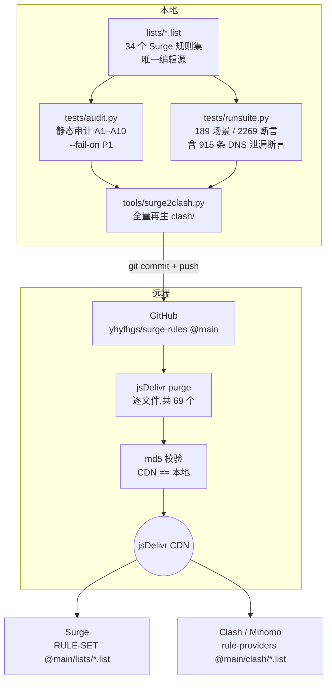
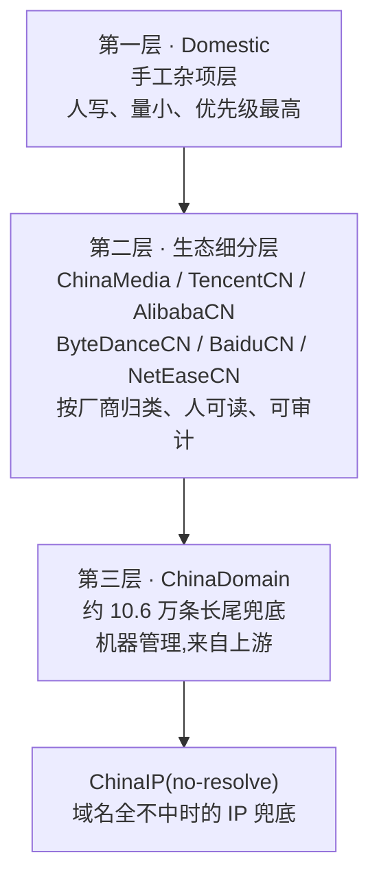
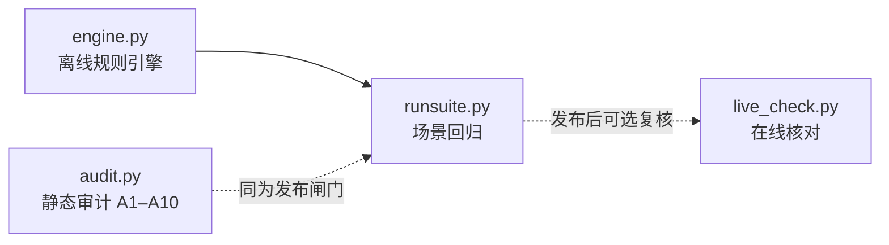

# 架构设计

本文档说明 surge-rules 的分发链、规则序设计、核心约束、派生层机制、既定设计裁决与测试体系。
日常操作步骤见 [MAINTENANCE.md](MAINTENANCE.md);module / script 开发见 [DEVELOPMENT.md](DEVELOPMENT.md);仓库总览见 [../README.md](../README.md)。

---

## 1. 分发链

### 1.1 全图



### 1.2 各环节职责

| 环节 | 位置 | 职责 | 不做什么 |
|---|---|---|---|
| 编辑源 | `lists/*.list` | 唯一手工编辑入口。所有规则变更从这里开始 | 不生成、不派生任何东西 |
| 静态闸门 | `tests/audit.py` | 结构性审计(A1–A10),`--fail-on P1` 时 P1 级问题直接阻断发布 | 不模拟真实请求 |
| 场景闸门 | `tests/runsuite.py` | 用离线引擎跑 189 个真实场景,校验落点策略与 DNS 行为 | 不联网、不依赖运行中的 Surge |
| 派生 | `tools/surge2clash.py` | 由 `lists/` 全量再生 `clash/` 与 `rule-providers.yaml` | 不做增量更新,不容忍未知规则类型 |
| 发布 | `update.sh` | 串起闸门→派生→commit→push→purge→md5 的全流程;仅限 main 分支发布,push 后校验远端 SHA,结果分 `VALIDATED_NOT_PUBLISHED` / `PUBLISHED_AND_VERIFIED`(退出 0) / `PUBLISHED_BUT_UNVERIFIED`(退出 1)三态 | 闸门未过一律中止,不发半成品;复验不一致时不谎报成功 |
| CDN | jsDelivr | 边缘缓存分发 | 不主动感知 GitHub 更新,必须显式 purge |
| 消费端 | Surge / Clash | 按远程 URL 拉取并按 conf 中的顺序匹配 | 不做本地二次加工 |

**为什么必须显式 purge**:jsDelivr 对 `@main` 分支路径有边缘缓存,push 之后 CDN 不会立刻反映新内容。`update.sh` 逐文件调用 purge 接口(本次 diff 中被删除的文件同样 purge,防止 CDN 留下已下线的旧表),再用 md5 逐文件比对 CDN 返回与本地文件,确认一致才算发布成功;遇上限流或复验不一致就落到 `PUBLISHED_BUT_UNVERIFIED` 并以非零码退出,绝不谎报成功。这是"改了但没生效"这类幽灵问题的根治手段。

---

## 2. Surge.conf `[Rule]` 规则序(0–10 十一区)

Surge 的 `[Rule]` 段是**自上而下首次命中即停**。因此规则序就是优先级,一个域名的最终去向完全取决于哪张表先碰到它。下表是完整规则序,以及每一区**为什么必须在这个位置**。

| 区 | 内容 | 去向 | 为什么在这个位置 |
|---|---|---|---|
| **0** | `SYSTEM`、PrivateLAN、PKU | DIRECT | 系统流量、内网域名、校园网必须先于一切分流。任何代理规则抢先命中都会破坏本机服务与内网可达性 |
| **1** | Reject | REJECT(**已启用**) | 拦截语义天然优先于分流:该丢弃的连接不应先被分配策略再丢弃。位次全链最前,收录即抢占 |
| **2** | GameDownloadCN | DIRECT | **须先于 Games / DownloadCDN**。国服游戏下载 CDN 与国际游戏平台、通用下载域高度重叠,不抢先命中就会被拉去走代理,把大流量下载塞进代理链路 |
| **3** | ModelDownloadCDN | 下载 | **须先于 AI**。大模型权重/数据集是大文件下载,走「下载」组而不是占用 AI 组的家宽中转;HF 站点浏览与 API 仍归 AI.list |
| **4** | YouTube(`extended-matching`) | 流媒体 | **须先于 Google**。YouTube 域名属于 Google 生态,若 Google 表先命中,YouTube 会被归到 Google-X-Meta-MS 组而非流媒体组,解锁与线路选择全错位 |
| **5** | Google / Twitter / Meta / Microsoft | Google-X-Meta-MS | 生态归属优先于服务分类。**须先于 AI** —— Gemini 属 Google、Grok 属 Twitter、Meta AI 属 Meta,若 AI 表先命中会把它们从各自生态里剥走 |
| **5** | AI(`extended-matching`) | AI 组 | 三大生态与 Microsoft 之后。独立 AI 服务商与 AI 基础设施 + 国内厂商国际站(GitHub 平台域与 Copilot 整链已归 Microsoft.list)。`extended-matching` 让规则同时匹配 SNI 等扩展信息,提升命中率 |
| **5** | TikTok / SocialOthers | 社交媒体 | 生态表之后的服务分类层 |
| **5** | Telegram | Telegram(独立组) | 服务分类层;单独成组便于独立选线 |
| **5** | Streaming | 流媒体 | 同上;YouTube 已在区 4 单独提前 |
| **5** | Games | 游戏 | GameDownloadCN(区 2)之后,国服下载已被摘走 |
| **5** | DownloadCDN | 下载 | 分类层最后。定位是「大流量批量下载域」,不是站点静态资源 |
| **6** | Payment(`extended-matching`) | Payment | 国际支付渠道必须固定同一出口,跨出口易触发 3DS/风控/拒付。置于 DownloadCDN 之后,下载域不被吸走 |
| **7** | AppleCN / MicrosoftCN | DIRECT | **先于 GFW 防抢跑**。ProxyGFW 中的宽泛后缀/关键词可能吃掉 Apple、微软的国内可直连面,导致本可直连的国内 CDN 被推去走代理 |
| **8** | ProxyGFW | Final | 被墙域名的兜底表。放在生态表与 Apple/微软之后,只捡前面没人认领的被墙域。**它的策略与收尾 `FINAL` 同为 `Final` 组** —— 这决定了本表的真实作用,见下方「区 8 的重定位」 |
| **9** | Japan / UK / Europe / US | 对应地区节点组 | **域名 + GEOIP/IP-ASN 同表自包含**,整体置于 Apple/微软/GFW **之后**、国内区**之前**。之后:地区表自带的 GEOIP 会遮蔽 Apple 17/8 与 ProxyGFW 的 IP 规则,前置就会抢跑;之前:地区表是明确归属,必须先于国内长尾兜底(ChinaDomain)与 `GEOIP,CN` 兜底命中 |
| **10** | Domestic | DIRECT | 国内直连第一层,手工杂项,国内区内最高优先 |
| **10** | ChinaMedia / TencentCN / AlibabaCN / ByteDanceCN / BaiduCN / NetEaseCN | DIRECT | 国内直连第二层,厂商生态细分 |
| **10** | ChinaDomain | DIRECT | 国内直连第三层,约 10.6 万条长尾兜底 |
| **10** | ChinaIP(`no-resolve`) | DIRECT | 域名全不命中后,按目的 IP 直连 |
| — | `RULE-SET,LAN`(`no-resolve`) | — | conf 内建收尾 |
| — | `GEOIP,CN`(`no-resolve`) | — | conf 内建收尾,ChinaIP 的补充近似 |
| — | `FINAL,Final,dns-failed` | Final | 全不命中 → 交远端解析(见 §4) |

### 一条口诀

> **越精确越靠前,越兜底越靠后;拦截 > 直连特例 > 生态 > 分类 > 被墙兜底 > 地区 > 国内三层 > FINAL。**

### 区 8 的重定位:ProxyGFW 是**保险层**,不是必需层

ProxyGFW 的策略是 `Final`,而 conf 收尾 `FINAL,Final,dns-failed` 的策略**也是 `Final`**(同一个 select 组);又因为全库 IP 类规则一律 `no-resolve`,域名请求在整条规则链上不触发任何本地解析。所以对绝大多数条目而言,「命中 ProxyGFW」与「一路落到 FINAL」的差别**只剩日志里那个规则名**。

2026-08-31 全量核算(6,427 条域名规则):

| 类别 | 条数 | 含义 |
|---|---:|---|
| **承载** | **18** | 后位表有更宽的兜底会接住它 ⇒ 删掉这一条,该域会被判成 **DIRECT**。后位分布:ChinaDomain 11 / Domestic 5 / TencentCN 2 |
| 惰性 | 6,409(99.7%) | 后位无覆盖,删掉也是落 FINAL → `Final`,**同策略、逐位等价** |

**裁决:不删表**,重定位为「**FINAL 策略保险层 + 防后位误直连层**」。三条操作性后果:

1. **验收基准改为那 18 条承载集**是否完整,不再按行数、也不按与上游对齐判定;惰性部分的增减**不作为回归**。死域再生过滤器必须给承载集开豁免 —— 承载集与 769 条死域清单的交集恰好 3 条(`666pool.cn` / `hasi.wang` / `bbs.tuitui.info`),它们之所以承载,正是因为后位有 `cn` / `wang` / `tuitui.info` 这类更宽的兜底。
2. **本表的存在理由是条件性的**:只要哪天裁决把 `FINAL` 的去向从 `Final` 改成 `DIRECT`,全表 6,427 条会**同时**变成承载条目。因此「99.7% 无用」不是删表的理由,它只是「当前 FINAL 恰好也是 `Final`」的推论。
3. 与之配套的宽后缀分层(`amazonaws.com` / `microsoft.com` / `azureedge.net`,见 D6)留在本表是刻意的:审计报「重复 / 遮蔽」属预期。

### `extended-matching` 该开在哪几张表:判据 R

`extended-matching` 让规则除域名外**同时匹配 SNI / Host 等扩展信息**,从而接住「客户端拿着字面量 IP 直连、但握手里带了域名」的连接。现状 **11 开 / 23 不开**,开关面**只在 conf 的 RULE-SET 行**。

> **判据 R** —— 当「本表策略」与「本表不命中后该请求最终会落到的策略」**不同**,且该表流量存在**可能携带 SNI / Host 的字面量 IP 连接**时,才值得开 `extended-matching`。

按 R 复核 34 张表,32 张与现状一致,且**不开是有理由的**:

- 国内直连各表的兜底是 `ChinaIP` + `GEOIP,CN` ⇒ **同为 DIRECT**,开了不改变落点;
- `ProxyGFW` 的策略就是 `Final`、与 FINAL 同组 ⇒ 同上,且代价是 6,424 条后缀 × 每连接多两个匹配键;
- 区 9 地区表自带 GEOIP / IP-ASN,在**同一位次**就接住了字面量 IP;
- `Games` 的硬编码 IP 流量是**裸 TCP/UDP,没有 SNI 可取**。

真正的两个缺口是 **`Reject`**(策略与兜底差最远,且广告 / HTTPDNS SDK 是硬编码 IP 的高发区)与 **`DownloadCDN`**(存在明文 HTTP + Host 头的按 IP 下载)。两者都**先测再加**:Reject 的前置条件是先清掉剩余的无边界特异词 —— 否则扩展匹配会让这些子串在 SNI 上也做匹配,这是最大风险点。

**红线**:官方语义是「set 文件里**任意一行**域名规则带 `extended-matching`,**整张表**的域名规则都被打开」。当前 `lists/` 行级为 0,必须保持为 0(见 [MAINTENANCE.md §6 红线 9](MAINTENANCE.md));Clash 侧无等价物,见 §5.2 的 sniffer 合同。

---

## 3. 国内直连三层设计

国内直连区(区 10)不是一张大表,而是**三层职责分明的表**,自上而下优先级递减:



| 层 | 表 | 定位 | 谁维护 | 变更频率 |
|---|---|---|---|---|
| 一 | Domestic | 手工杂项:临时补丁、上游没覆盖的域、需要立刻生效的特例 | 人工逐条 | 高 |
| 二 | ChinaMedia / TencentCN / AlibabaCN / ByteDanceCN / BaiduCN / NetEaseCN | 大厂生态按主体归类,便于按厂商审阅与整体调整 | 人工 + 上游对齐 | 中 |
| 三 | ChinaDomain | 国内域名长尾兜底,约 10.6 万条 | **机器管理**,随上游整体替换 | 低(整表刷新) |

### 「手工条目勿加 ChinaDomain」

ChinaDomain 是**整表机器替换**的层。往里面手写条目,下一次上游同步就会被无声抹掉,而且因为体量太大,没人会发现少了什么。

规矩很简单:

- **要立刻生效、临时性的** → 写进 Domestic(第一层)。
- **属于某个大厂生态的** → 写进对应的厂商细分表(第二层)。
- **ChinaDomain** → 只能整表刷新,永远不手工编辑单条。

三层之间同样遵守**唯一归属**:一个域名在 Domestic 出现过,就不该再出现在厂商表或 ChinaDomain 里。级联去重的执行方式见 [MAINTENANCE.md](MAINTENANCE.md)。

---

## 4. 核心约束:全链路零本地 DNS 解析

这是整套规则最重要、也最容易被"好心修复"破坏的设计。

### 4.1 规则

> **所有 IP 类规则(`IP-CIDR` / `IP-CIDR6` / `GEOIP` / `IP-ASN`)必须带 `no-resolve`。任何合并、任何上游同步,都不得引入无 `no-resolve` 的 IP 规则。**

### 4.2 原理

Surge 匹配一条 IP 类规则时,如果连接的目标是**域名**而不是字面 IP,它必须先把域名解析成 IP 才能比较。没有 `no-resolve`,这个解析就在**本地**发生,后果有三:

1. **DNS 泄漏** —— 本该由远端代理解析的域名,查询包从本机发了出去。这既暴露了访问意图,也在被污染的解析路径上拿回错误结果。
2. **延迟惩罚** —— 每条无 `no-resolve` 的 IP 规则,都可能在匹配阶段触发一次阻塞式解析。规则表越长,惩罚越重。
3. **错误分流** —— 污染或 CDN 就近解析返回的 IP,和真实目标可能落在完全不同的地理区间,GEOIP 判定随之出错。

加上 `no-resolve` 后,IP 类规则**只对已经携带字面 IP 的连接生效**,域名连接直接跳过继续往下匹配。

### 4.3 未命中域名怎么办

规则序末尾是 `FINAL,Final,dns-failed`。

- 所有域名规则都不命中的域名,**不在本地解析**,直接按 FINAL 交给 `Final` 策略组,**由远端出口完成解析**。这正是"零本地 DNS 解析"闭环的收口。
- `dns-failed` 参数覆盖另一种情形:本地 DNS 解析确实失败的连接同样兜到 FINAL,交远端处理,而不是直接失败。

### 4.4 为什么这条约束需要 915 条断言守着

`runsuite.py` 的 2269 条断言里有 **915 条专门是 DNS 泄漏断言**。原因是这条约束的破坏方式极其隐蔽:上游同步一批 IP 段、有人"顺手"给某条 GEOIP 去掉 `no-resolve` 想"修一个不生效的规则",分流表面看还是对的,泄漏却已经发生。只有把它变成会打红的断言,才守得住。

### 4.5 第三根支柱:两个必须保持 `false` 的 conf 键

前面两节是这条约束的头两根支柱 —— **IP 规则的 `no-resolve`**(§4.1,915 条断言守着)与 **`FINAL,Final,dns-failed`**(§4.3,收口)。闭环还有第三根,它**不在规则里、在 conf 里,且没有任何断言能看见**:

| 键 | 值 | 作用 |
|---|---|---|
| `use-local-host-item-for-proxy` | `false`(**conf 已显式写死**) | 官方默认就是 false。一旦为 true:目标域只要存在**本地 DNS mapping**,Surge 就会用 **IP 而不是域名**建立代理连接 —— 这正是本节禁止的行为。而本 conf 同时开着 `read-etc-hosts = true`,`/etc/hosts` 里的条目就是这样的 local DNS mapping ⇒ **两键叠加即精确破坏该架构** |
| `allow-dns-svcb` | 缺省(即 `false`,**刻意不写**) | 关闭时 Surge 拒绝 SVCB / HTTPS(type 65)查询,恰好堵住「用 HTTPS RR 的 `ipv4hint` 绕过 fake-IP」这条路。配合 `hijack-dns = *:53`(客户端查询在 53 端口就被 fake-IP 应答器接住),规则链**始终看到原始域名**,即便客户端自行解析也一样 |

两点操作性含义:

1. **`use-local-host-item-for-proxy` 之所以显式写出来**,不是因为默认值不对,而是因为它默认对、但没人看得见:915 条断言只检 IP 规则的 `no-resolve`,不解析 conf 的这个键;全库搜索它在文档、测试、裁决登记里一次都没出现过。显式写死 + [MAINTENANCE.md §6 红线 8](MAINTENANCE.md) 是它唯一的守护。
2. **不要为了"支持 ECH / HTTPS RR"去开 `allow-dns-svcb`** —— 那等于给零本地解析闭环开一个 IP 直通口。这也是全库 13,333 条 IP 类规则实际很少被触发的原因之一:真正会走到 IP 规则的,只剩**硬编码 IP 字面量**的连接。

---

## 5. Clash 派生层设计

### 5.1 单一编辑源原则

```
lists/*.list  ──(tools/surge2clash.py 全量再生)──▶  clash/*.list + clash/rule-providers.yaml
   ▲                                                         ▲
唯一手工编辑入口                                    纯派生产物,禁止手工编辑
```

任何在 `clash/` 里的手改都会在下一次 `update.sh` 被覆盖,而且不会有任何提示。要改 Clash 端的行为,只能改 `lists/` 或改转换器。

### 5.2 转换约定

| Surge 侧 | Clash 侧 | 说明 |
|---|---|---|
| `DOMAIN-WILDCARD` | 原样透传 | Mihomo ≥1.19 原生支持 `DOMAIN-WILDCARD`,`*` / `?` 语义与 Surge 一致(2026-08-31 前曾转写为 `DOMAIN-REGEX`) |
| `USER-AGENT` | (剔除) | Clash 无 UA 匹配层。剔除数量记在目标文件头 |
| `URL-REGEX` | (剔除) | Clash 无 URL 匹配层。剔除数量记在目标文件头 |
| 其余类型(含 `no-resolve`) | 原样透传 | `no-resolve` 语义两端一致,必须保留 |
| `extended-matching`(conf 的 RULE-SET 行,现 11 处) | **无等价物,provider 携带不了** | 它不是规则行上的参数,而是**整张表的匹配语义**(见 §2「判据 R」)。rule-provider 只承载规则集本身,无处安放这个开关 ⇒ Clash / Mihomo 端必须由**使用者在自己的 config 里显式配 `sniffer`** 才能取回等价行为 |
| 未知类型 | **fail-fast** | 转换器中止,发布随之中止。宁可不发,不做静默降级 |

#### 能力差额的账本

原本的账本是「被剔除的 UA / URL 规则条数」,记在目标文件头。但 D7 之后**这两类在全库已归零**,那份计数恒为 0 —— **旧账本已经空了**。当前两端真实的差额全部转移到了 `extended-matching` 上,而它**不可计数**:差的不是若干条规则,是 11 张表的匹配语义。

#### sniffer 合同(消费端必须履约)

Surge 侧开 `extended-matching` 的 11 张表(含 Payment / AI / Telegram)会用 SNI / Host 兜底「客户端拿着字面量 IP 直连」的场景。Clash / Mihomo 侧要取回这个行为,**使用者必须自行开启 `sniffer`**,至少嗅探 TLS SNI 与 HTTP Host。

- **不配 sniffer 不会报任何错**,只会在上述连接上**静默漏匹配**——这是本派生层最容易被忽略的一处能力差。
- 合同的书面落点有两处:本节,以及 `clash/rule-providers.yaml` 头部注释(由 `tools/surge2clash.py` 的模板产出)。改动其一必须同步另一处。
- 与它并列的已知能力差还有两条:`SYSTEM` 在 Clash 端**无等价物**;内建 `LAN` 用 `GEOIP,lan` 近似。三条都是**已知且刻意**的取舍,不是 bug。

### 5.3 142,708 条守恒验证

派生层的正确性基线是:**`lists/` 源规则总数与 mihomo 实载后规则总数守恒**。

| 日期 | 基线 | 取数方式 | 状态 |
|---|---:|---|---|
| 2026-08-31(修复批次前) | 143,640 | Mihomo 1.19.20 实载 34 个 classical provider,controller API 汇总 `ruleCount` | 已作废 |
| **2026-08-31(修复批次后)** | **142,708** | `python3 tools/surge2clash.py --check` —— 34 表 / 142,708 条,`lists/` 与 `clash/` 逐表一致 | **当前基线** |

**2026-08-31 修复批次重标:143,640 → 142,708(净 −932 条)**。删除面集中在多租户/PSL 注册边界后缀、S3 兼容对象存储族、死条目与信任面清理;迁移(Google `-cn` 族 → Domestic、BBC 专属播放面 → UK、DownloadCDN 静态子域 → 各地区表)在总数上互相抵消。逐项见 [`CHANGELOG.md`](../CHANGELOG.md) 2026-08-31 条目。

> ⚠️ **本基线取自转换器计数,不是 mihomo 实载复验。** 上一版 143,640 是 controller API 的 `ruleCount` 实测值,本版因批次收尾未再起 mihomo 实例。**mihomo 实载复验留待下次发布前补做**;补做后若两者不等,以实载值为准并回写本节。

验证 mihomo 实载数时有两个坑:

1. `mihomo -t`(配置测试)是**懒加载**,不会真正拉取和解析 rule-provider 的内容,数出来的数字没有意义。必须**真正启动**,再查 API 的 `ruleCount`。
2. provider 是**异步初始化**的。启动后立刻查会读到偏小的数字,需要**等约 10 秒**让所有 provider 就绪再读。

---

## 6. 设计裁决记录

以下裁决均已固化进 `tests/` 断言与 `tests/allowlist.json`。**逆向"修复"会直接打红断言** —— 看到某条规则"看起来不对"时,先在这张表里找一遍。

| # | 裁决 | 理由 |
|---|---|---|
| D1 | **Microsoft.list 独立成表**(Copilot / Bing / MSN / GitHub 平台 / 国际登录面;条数随维护浮动,不在此登记),与 Google / Twitter / Meta 同走 Google-X-Meta-MS 组 | 微软国际面是独立生态,不是 AI 服务。曾并入 AI 组,已改回独立表 |
| D2 | **GitHub 平台域与 Copilot 整链归 Microsoft.list**(2026-08-30 裁决,推翻早期「留 AI 组」方案) | 生态归属优先:github.com/githubassets/ghcr.io 与 githubcopilot.com/githubnext.com 同走 Google-X-Meta-MS 组,登录/平台/推理整链同出口 |
| D3 | **国内厂商的国际站走代理**(coze.com / qwen.ai / z.ai / minimax.io / moonshot.ai / fastgpt.in 等归 AI.list),对应 `.cn` 域直连 | 国际站部署在境外,直连体验差;同厂商的 `.cn` 域仍是国内服务,保持直连 |
| D4 | **DownloadCDN 定位收窄为「大流量批量下载域」** | 它一度膨胀成站点静态资源大杂烩,与生态表大面积重叠。收窄后职责单一,533 个站点静态域已剥离 |
| D5 | **`gateway.icloud.com` 不再单列**,由 AppleCN 的 `icloud.com` 后缀直连覆盖(2026-08-30 裁决,推翻早期「留 AI.list」方案) | 代价:Apple Intelligence/PCC 在大陆出口不可用;若需恢复,在 AI.list 重新单列该域 |
| D6 | **`DOMAIN-SUFFIX,amazonaws.com` 留在 ProxyGFW** | 刻意的 AWS 兜底。具体 CDN 子域已在 DownloadCDN 分层承接,`amazonaws.com` 本身作为宽口径兜底留在 GFW 表 |
| D7 | **全库不使用 PROCESS-NAME / USER-AGENT**(2026-08-30 用户裁决,替代旧 D7「大小写变体不去重」) | 两类规则按 App 维度**全域生效**:App 内异质流量(内置浏览器/webview/系统共享域)会被整体误接管,且防误抓完全依赖 conf 顺序这一根独木桥(实证:Codex (Service) 访问 bilibili 曾被拽进 AI 组)。域名收录+extended-matching+IP 段兜底已足;未收录新域落 FINAL 仍走代理,无功能损失。**上游合并与再生一律剔除这两类规则**;若日后接入下游 iOS 设备(网关/Ponte,进程规则不可用、UA 成为区分 App 的唯一手段)可重新评估 |
| D8 | **地区表自包含 IP 规则并整体后置** | 地区表内的 GEOIP / IP-ASN 若前置,会遮蔽 Apple 17/8 与 ProxyGFW 的 IP 规则 |
| D9 | **落地机房线路商随附的 conf 保留**(备份在仓库外的 `Backup/`,文件名带厂商标识故不入库) | 已补 `no-resolve` 加固,不违反零本地 DNS 解析约束 |
| D10 | **MITM 的 enable 键不写进 conf** | MITM 已启用,开关在 GUI 运行态。Surge 会把 `enable` 键从 conf 规范化移除;conf 只保留 `h2=true`。**不要反复往 conf 写 `enable`** —— 它每次都会被抹掉 |
| D11 | **合并排除表** | 以下上游条目**不合并**:`DOMAIN-KEYWORD,google`、`akadns.net`、`stripe`、`ms`(ccTLD)、porn / facebook 等关键词;以及(按 D7 新裁决)**全部 `USER-AGENT` 与 `PROCESS-NAME` 类型规则**——上游合并、ChinaDomain 再生时按类型整体剔除,无需逐条列举(下方 5 条宽 UA 清单保留作历史依据与危险性说明) |

#### D11 附:5 条宽 `USER-AGENT` 排除项(2026-08-30 审计新增)

`USER-AGENT` 规则是**全域生效**的 —— 它不看域名,只看请求的 User-Agent,因此一条宽 UA 会把该 app 访问的**任何**域按本表策略处理。全域生效的宽 UA 会把境外域打直连 / 国内域打代理,再生 `ChinaDomain.list` 时必须过滤:

| 排除条目 | 误伤方式 |
|---|---|
| `USER-AGENT,Microsoft*` | Office 系 app(UA 形如 `Microsoft Office/16.0`)访问的境外未收录域被打成 DIRECT。已实证 |
| `USER-AGENT,hide*` | 极宽;`hide.me` 等 VPN 服务及任何 UA 以 hide 开头者被强制直连 |
| `USER-AGENT,TeamViewer*` | 国际远控服务被强制直连 |
| `USER-AGENT,QQ*` | QQ / QQ 浏览器内置浏览器打开境外链接失效(与 D7 旁的铁律「TencentCN 加微信进程有害」同构) |
| `USER-AGENT,TIM*` | 同上 |

**不要用「在更早的表加对冲 UA」来解决。** 任何位置的对冲都会误伤:放 `Microsoft.list` 会把 `officecdn.microsoft.com` / `office.com` / `onedrive` 等刻意直连的域拽进代理组;放 `ProxyGFW.list` 会劫持其后 Japan / UK / Europe / US / Domestic / 各国内厂商表的域。正确做法只有走本排除表 + 再生时过滤。

这 5 条已于 2026-08-30 从 `ChinaDomain.list` 直接删除,并在 `tests/allowlist.json` 登记 preventive 条目 —— 一旦被误合并回来,审计会立刻发现。同批处理的还有 `TencentCN.list` 的 `USER-AGENT,MicroMessenger*` / `USER-AGENT,WeChat*`(手工表,直接删除,不入排除表)。

### 6.1 已否决方案(仅作历史记录,勿再提议)

以下方案曾被提出并**由用户明确否决**。此处只作为历史存档,说明"为什么现在不是这样",**不得作为建议重新提出**:

| 方案 | 现状 | 否决记录 |
|---|---|---|
| conf 顶部加 jsdelivr 自锚规则 | 已删除。`jsdelivr.net` 归 DownloadCDN 管理 | 已否决 |
| 用 mask 域 REJECT 禁用 iCloud Private Relay | 已删除。Private Relay 保持可用 | 已否决 |
| 微软并入 AI 组 | 已改为 Microsoft.list 独立成表(见 D1) | 已否决 |

---

## 7. 测试体系设计

四件套各司其职,覆盖"静态结构 → 离线行为 → 在线核对"三个层次。



| 组件 | 角色 | 依赖 | 是否发布闸门 |
|---|---|---|---|
| `engine.py` | **离线规则引擎**。只读解析 `Surge.conf` 与本仓库 `.list`,复现 Surge 的自上而下匹配语义,给出"某请求最终落到哪个策略、路上是否触发本地解析" | 只读,不联网 | 否(被 runsuite 使用) |
| `audit.py` | **静态审计**。A1–A10 十项结构性检查(判据见下表);配合 `allowlist.json` 的 `exemptions` 段豁免既定裁决,`forbidden` 段则由 A8 强制、**不可豁免** | 只读 | **是**(`--check all --fail-on P1`) |
| `runsuite.py` | **场景回归**。用 engine 跑 `scenarios/*.json` 中的 **189 个真实场景**,断言 **2269 条**,其中 **915 条 DNS 泄漏断言** | engine.py | **是** |
| `live_check.py` | **在线核对**。对着运行中的 Surge 实例验证真实落点 | **需要 conf 开启 http-api** | 否(手动运行) |

audit 的八项判据(严重度分级 P0–P3,详见 [../tests/README.md](../tests/README.md)):

| 项 | 检查什么 | 为什么重要 |
|---|---|---|
| A1 | IP 类规则缺 `no-resolve` | 直接对应 DNS 泄漏,本体系的头号红线 |
| A2 | 跨 list 精确重复 | 后出现的那条是死条目 |
| A3 | 同 list 内部覆盖 | `DOMAIN` 被同表 `SUFFIX` 吃掉之类 |
| A4 | 跨 list 遮蔽 | 尤其「直连区条目被代理区抢跑」= P0 |
| A5 | conf 引用完整性 | 引用了不存在的 list,或有 list 没人引用 |
| A6 | `DOMAIN-KEYWORD` 清单 | 只列出来给人复核,不判对错 |
| A7 | 规则行格式 lint | 无类型前缀的裸行会被 Surge 与本套引擎静默忽略 = 死规则,判 P1 |
| A8 | 禁止回流 | `allowlist.json` 的 `forbidden` 段登记「必须持续不存在」的规则模式(USER-AGENT / PROCESS-NAME / URL-REGEX 全类型、D11 上游合并排除项、已删品牌关键词),命中即 P0,且**不可被 exemptions 豁免** |

### 7.1 引擎的两个已知近似

1. **规则目录推导**:`engine.py` 由传入的 conf 路径推导 `rules_dir` = `<conf 同级>/rules/lists/`。这里硬编码了「仓库目录名必须叫 `rules`、且与 `Surge.conf` 同级」的约定;目录改名或另置时,`audit.py` / `runsuite.py` 需用 `--rules` 参数显式指定。
2. **GEOIP,CN 近似**:引擎没有内置 GeoIP 数据库,`GEOIP,CN` 的判定**硬引用 `ChinaIP.list` 做近似**。这意味着引擎眼中的 CN 判定范围等同于 ChinaIP 的覆盖,与 Surge 内置库存在细微差异 —— 涉及边界 IP 的结论,以 `live_check.py` 的在线核对为准。

### 7.2 内嵌 self-test 不可破坏

`audit.py` 与 `engine.py` **底部各有一段内嵌 self-test**,用 tempdir fixtures 构造最小规则集来验证引擎与审计器自身的逻辑。它们**不依赖真实仓库布局**,因此任何目录重构都不应该动到它们。改这两个文件时,self-test 必须保持可运行 —— 它是"测试工具本身是否还正确"的唯一保障。

---

## 8. 相关文档

- [../README.md](../README.md) —— 仓库总览、34 表清单、快速开始
- [MAINTENANCE.md](MAINTENANCE.md) —— 新增规则决策树、验证、发布、排障、红线
- [DEVELOPMENT.md](DEVELOPMENT.md) —— module / script 开发指南
- [../CHANGELOG.md](../CHANGELOG.md) —— 版本更新记录
