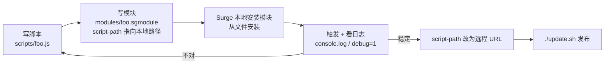

# module / script 开发指南

本文档为下一阶段的 Surge 模块与脚本能力铺路。当前仓库交付的是**目录骨架 + 模板文件 + 本指南 + 本地参考库**,尚无生产模块。

规则相关内容见 [ARCHITECTURE.md](ARCHITECTURE.md) 与 [MAINTENANCE.md](MAINTENANCE.md);仓库总览见 [../README.md](../README.md)。

---

## 1. 目标能力路线图

在 MitM + module + script 三件套之上,规划中的能力方向:

| 方向 | 说明 | 主要依赖 |
|---|---|---|
| **更精确的分流** | 从"域名/IP 级"下沉到 "URL / header 级"。同一个域名下,按路径或请求头把流量拆到不同策略 | MitM + `[Rule]` 内的 URL 类规则 + `[Script]` |
| **日志搜集** | 按需记录特定域名/接口的请求与响应元数据,供后续分析 | MitM + `http-request` / `http-response` 脚本 |
| **流量数据统计** | 细粒度统计各服务的流量与调用次数,形成可读报表 | 脚本 + `$persistentStore` + `[Panel]` |
| **应用与网页去广告** | App 内广告接口与网页广告的拦截、改写、置空 | `[URL Rewrite]` / `[Map Local]` / `[Rule]` REJECT |
| **自动打卡 / 签到** | 定时触发的签到类任务,结果推送通知 | `cron` 脚本 + `$httpClient` + `$notification` |
| **自动化脚本** | 网络状态变化等事件触发的自动化动作 | `event` 脚本 |

**本次只交付**:`modules/` 与 `scripts/` 目录骨架、两个模板文件、本指南、`reference/` 参考项目库。

---

## 2. sgmodule 格式规范

一个 Surge 模块是一个 `.sgmodule` 文本文件:顶部是 `#!` 元信息,下面是若干功能段。

### 2.1 元信息头

```
#!name=示例模块
#!desc=一句话说明这个模块干什么
#!category=分类名
#!system=ios,mac
#!arguments=key:默认值
#!arguments-desc=参数说明,展示在模块设置界面
```

`#!arguments` 声明的参数,在脚本里通过 `$argument` 读取,在模块内通过 `{{{key}}}` 插值引用。有了它,同一个模块不必为不同配置分叉出多个版本。

### 2.2 功能段语义

| 段 | 语义 | 典型用途 |
|---|---|---|
| `[Rule]` | 追加分流规则到主配置 | 模块自带的 REJECT 规则、模块专属域名的策略绑定 |
| `[URL Rewrite]` | 在**请求发出前**改写或拦截 URL | 去广告(`reject` / `reject-200`)、重定向到替代接口 |
| `[Header Rewrite]` | 改写请求 / 响应头 | 注入或删除特定 header |
| `[Map Local]` | 用**本地构造的响应**直接回应请求,不发出真实请求 | 把广告接口置空返回 `{}`、伪造接口响应做解锁 |
| `[Script]` | 声明脚本及其触发条件 | 一切需要逻辑判断的场景 |
| `[MITM]` | 声明本模块需要解密的域名 | 上述 URL / header / body 级能力的前提 |
| `[General]` | 追加通用配置项 | 谨慎使用,容易与主配置冲突 |
| `[Host]` | 追加 DNS 映射 | 谨慎使用 |
| `[Panel]` | 声明面板,展示脚本产出的信息 | 流量统计、状态展示 |

### 2.3 `[Script]` 段写法

```
脚本名称 = type=http-response, pattern=^https?://example\.com/api/ads, requires-body=1, max-size=131072, timeout=30, script-path=https://cdn.jsdelivr.net/gh/yhyfhgs/surge-rules@main/scripts/example.js, argument="{{{key}}}"
```

常用字段:

| 字段 | 作用 |
|---|---|
| `type` | 脚本类型,见 §3 |
| `pattern` | 匹配 URL 的正则(`http-request` / `http-response` 用) |
| `requires-body` | 是否需要读取 body。要改 body 就必须置 `1` |
| `binary-body-mode` | 按二进制处理 body |
| `max-size` | body 大小上限,超过则不进脚本。**必设**,否则大响应会拖垮性能 |
| `timeout` | 脚本超时秒数。**必设**,防止脚本挂死拖住连接 |
| `script-path` | 脚本位置,可以是远程 URL,也可以是本地路径(调试用) |
| `argument` | 传给脚本的参数,脚本内以 `$argument` 读取 |
| `debug` | 开启后输出更详细的日志 |

### 2.4 `[MITM] hostname = %APPEND%` —— 防冲突的关键

```
[MITM]
hostname = %APPEND% api.example.com, *.example.net
```

`%APPEND%` 的语义是**把这些域名追加到主配置已有的 hostname 列表**,而不是整体覆盖。

**必须始终使用 `%APPEND%`。** 不带它的写法会替换掉主配置的 hostname 列表 —— 装上一个模块,其他所有模块和主配置的 MitM 域名全部失效,而且症状是"某些功能莫名其妙不工作了",极难定位。

**集中管理约定**:

1. 每个模块**只声明自己真正需要的域名**,不要图省事写通配大范围。
2. 域名尽量写具体:`api.example.com` 优于 `*.example.com`,`*.example.com` 优于更宽的通配。
3. 多个模块声明同一域名是可以的(`%APPEND%` 会去重合并),但要明确**哪个模块对这个域名的行为负责**,避免两个模块对同一响应各改一半。
4. 证书相关配置(CA 证书及其口令等)**只存在于 Surge 运行态与 GUI**,任何时候都**不得写进本仓库的任何文件** —— 这是公开仓库。

---

## 3. Surge 脚本类型与核心 API

### 3.1 脚本类型

| type | 触发时机 | 典型用途 | 关键上下文 |
|---|---|---|---|
| `http-request` | 请求发出**前** | 改写请求、注入 header、短路返回伪造响应 | `$request` |
| `http-response` | 收到响应**后**、交给客户端**前** | 改写响应体、剔除广告字段、提取数据 | `$request`、`$response` |
| `cron` | 按 cron 表达式定时 | 自动签到 / 打卡、定时拉取 | 无请求上下文 |
| `event` | 系统或网络事件 | 网络切换时的自动化动作 | 事件相关信息 |
| `dns` | DNS 解析阶段 | 自定义解析逻辑 | 域名 |
| `generic` | 手动 / 外部触发 | 一次性任务、面板刷新 | 无请求上下文 |

`cron` 的写法示例:

```
每日签到 = type=cron, cronexp="0 8 * * *", wake-system=1, timeout=60, script-path=...
```

`event` 的写法示例:

```
网络变化处理 = type=event, event-name=network-changed, script-path=...
```

### 3.2 核心 API

| API | 用途 | 要点 |
|---|---|---|
| `$httpClient.get / post / put / delete` | 发起 HTTP 请求 | 回调形式 `(error, response, data)`。**必须处理 `error` 分支**,否则失败时脚本静默卡住直到超时 |
| `$persistentStore.read(key)` / `.write(value, key)` | 持久化读写 | 跨次运行保存 token、上次执行时间、统计累计值 |
| `$notification.post(title, subtitle, body)` | 推送通知 | 签到类脚本的结果反馈出口 |
| `$argument` | 读取模块传入的参数 | 与 `#!arguments` + `{{{key}}}` 配套 |
| `$done(value)` | **结束脚本** | 每条执行路径**有且只有一次** `$done`。`http-request` 中 `$done({})` 表示放行原请求;`http-response` 中 `$done({body})` 表示替换响应体;`cron` 用 `$done()` |
| `$environment` | 运行环境信息 | 用于区分 iOS / macOS 等平台差异 |

其他常用对象:`$request` / `$response`(HTTP 脚本上下文)、`console.log`(输出到 Surge 日志)、`$script`(脚本自身信息)、`$network`(网络状态)、`$utils`(GeoIP / ASN 等工具)。

> 上述 API 的完整签名与行为以 Surge 官方文档为准,本地抓取放在 `reference/surge-docs/`。

### 3.3 `$done` 的纪律

这是脚本最常见的故障源:

- **漏掉 `$done`** → 该连接一直挂到 `timeout` 才被放行,用户体验上表现为"某个 App 偶尔卡几十秒"。
- **调用两次 `$done`** → 行为未定义。
- **异步回调里忘了 `$done`** → 同上,而且只在网络出错时才复现,极难排查。

写法上的自保:每个 `$httpClient` 回调的 `error` 分支、`try/catch` 的 `catch` 分支,都要有自己的 `$done`。

---

## 4. MitM 工作原理与 hostname 纪律

### 4.1 原理简述

HTTPS 流量默认对代理不可见 —— 代理只看得到 SNI 和目的 IP,看不到 URL 路径、header 和 body。

MitM(中间人解密)让 Surge 用自签 CA 为指定域名签发证书,对客户端扮演服务端、对服务端扮演客户端,从而在中间**看到并修改明文内容**。这是 `[URL Rewrite]`、`[Header Rewrite]`、`[Body Rewrite]`、`[Map Local]` 以及 `http-request` / `http-response` 脚本能够工作的前提 —— 没有 MitM,这些能力对 HTTPS 一律无效。

代价有三:

1. **性能** —— 每条被解密的连接都多一次握手与加解密开销。
2. **兼容性** —— 启用了证书固定(certificate pinning)的 App,MitM 会直接导致连接失败。
3. **信任面** —— 被解密的域名,其明文内容对本机上的规则与脚本完全可见。

### 4.2 hostname 管理纪律

| 纪律 | 理由 |
|---|---|
| **只解密真正需要的域名** | 每个域名都是性能与兼容性成本,宽通配尤其危险 |
| **一律用 `%APPEND%`** | 不带它会覆盖全局 hostname 列表,静默毁掉其他模块 |
| **优先写具体域名而非通配** | 通配会把同域下无关的 App / 接口一并卷进来 |
| **遇到 pinning 的 App 就别解密它** | 解不了还会把 App 弄坏,得不偿失 |
| **MITM 的 `enable` 键不写进 conf** | Surge 规范化时会移除它;开关在 GUI 运行态,conf 只保留 `h2=true` |
| **证书材料永不入库** | 公开仓库,CA 证书与其口令一旦提交就永久留在历史里 |

---

## 5. 本地开发调试流



### 5.1 步骤

1. **本地写** —— 脚本放 `scripts/`,模块放 `modules/`。
2. **本地装** —— 在 Surge 中从文件安装模块(而不是从 URL),这样每次改完文件重载即可生效,不必等 CDN。
3. **`script-path` 用本地路径调试** —— 指向本机脚本文件,改一行看一次效果,避免"改一行 push 一次 purge 一次"的漫长回路。
4. **看日志** —— `console.log` 的输出进 Surge 日志;在 `[Script]` 声明里加 `debug` 可以看到更详细的执行信息。配合 Surge 的请求详情面板,可以核对脚本是否真的被触发、body 是否被读到。
5. **稳定后入库** —— 把 `script-path` 改为远程 URL,提交并通过 `./update.sh` 发布。

### 5.2 入库后的引用路径

模块与脚本入库后的引用形式与规则集一致:

```
https://cdn.jsdelivr.net/gh/yhyfhgs/surge-rules@main/modules/<name>.sgmodule
https://cdn.jsdelivr.net/gh/yhyfhgs/surge-rules@main/scripts/<name>.js
```

> `update.sh` purges `lists/`, `clash/`, and `clash/rule-providers.yaml`
> (currently 79 distribution files). Modules/scripts are outside that set.
> Add those directories to `DIST_RE` only when the first production module or
> script is published; templates should not consume CDN purge quota.

---

## 6. 模板文件导读

### `modules/_template.sgmodule`

新模块的起手模板。包含 `#!name` / `#!desc` / `#!category` / `#!system` 等元信息头的占位,以及 `[Rule]`、`[URL Rewrite]`、`[Map Local]`、`[Script]`、`[MITM]` 各段的注释骨架。`[MITM]` 段已按约定写成 `hostname = %APPEND% ...` 形式 —— **复制模板时不要把 `%APPEND%` 删掉**。

用法:复制一份改名,按 §2 填内容,删掉用不到的段。

### `scripts/_template.js`

新脚本的起手模板。包含一个带完整错误处理与 `$done` 收口的脚本骨架:`$argument` 参数读取、`$httpClient` 调用及其 `error` 分支、`try/catch` 包裹、以及每条路径上的 `$done`。

用法:复制一份改名,替换业务逻辑,**保留错误处理与 `$done` 结构**。

---

## 7. 参考项目导读

以下项目抓取在 `reference/` 下,供本地查阅上游写法。各项目的本地目录名、关键文件与按开发方向的导航,见 `reference/README.md`(本地索引,不入库)。

| 项目 | 参考什么 |
|---|---|
| `blackmatrix7/ios_rule_script` | 分流规则集的组织方式与命名体系;本仓库 ChinaDomain 长尾与 6 个 CN 细分表的上游来源 |
| `NobyDa/Script` | 签到 / 打卡类脚本的成熟写法:cron 调度、多账号处理、通知汇总 |
| `chavyleung/scripts` | `Env.js` 多平台统一封装(一份脚本跑 Surge / QX / Loon)与签到脚本框架;其生态的 BoxJs 面板负责参数可视化管理 |
| `VirgilClyne/GetSomeFries` | 模块工程化范例:模块与脚本的目录组织、参数化、多平台适配 |
| `VirgilClyne/iRingo` | Apple 服务增强(Weather / Maps / Siri / TestFlight 等数据源替换):`[URL Rewrite]` / `[Map Local]` / 响应改写的实战用法。上游主仓已迁往 NSRingo 组织,本地已含其 9 个子仓库 |
| `Semporia/TikTok-Unlock` | 单一 App 的定向解锁:MitM 域名收敛与改写配合分流的完整案例 |
| `app2smile/rules` | 去广告模块的分段组织与 hostname 管理实践 |
| `yichahucha/surge` | 经典 Surge 脚本合集:`http-response` 脚本骨架与响应体处理写法 |
| `zmqcherish/proxy-script` | 签到 / 去广告脚本合集,可作为具体场景的实现参考 |
| `Script-Hub-Org/Script-Hub` | 规则与脚本的格式转换、本地调试工具链 |
| `sub-store-org/Sub-Store` | 订阅与规则集的管理、批处理与脚本化操作 |
| `fmz200/wool_scripts` | 去广告规则与拦截清单的组织方式 |
| `xream/scripts` | Surge / Loon 脚本片段与常用工具函数 |
| `reference/surge-docs/` | **Surge 官方文档本地抓取**。模块格式、脚本 API、MitM 行为的**权威依据**,与本文档冲突时以它为准 |

> `reference/` 已在 `.gitignore` 中,**仅供本地查阅,不入库**。参考上游写法时注意其许可与署名要求,不要整段抄进本仓库。

### 7.1 起步锚点

按本仓库的能力路线图,以下文件是各方向的最短起跑线(路径相对 `reference/`):

| 方向 | 锚点 | 为什么从它开始 |
|---|---|---|
| 定时签到 / cron 模块 | `xream-scripts/surge/modules/mitm-checker/mitm-checker.sgmodule` | 最完整的 sgmodule 参数化范例:`#!arguments` + `#!arguments-desc` + `type=cron` + `cronexp` + `engine=jsc` |
| 日志搜集 | `xream-scripts/surge/modules/network-log/network-log.js` | 现成实现:把 `$request` / `$response` 打包上报,上报地址与字段全部可配置 |
| 规则修饰符实战 | `GetSomeFries/sgmodule/HTTPDNS.Block.sgmodule` | `pre-matching` + `extended-matching` + `no-resolve` 的教科书用法,与本仓库零解析约束直接相关 |
| 二进制响应改写 | `app2smile-rules/js/bilibili-proto.js`(对照同目录 `*-json.js`) | protobuf 响应体改写与 `binary-body-mode` 实战,JSON / protobuf 两条路线可对照 |
| 跨平台格式差异 | `Script-Hub/Rewrite-Parser.js` | 各家(QX / Loon / Stash / Egern / Surge)重写语法的解析器集中在一处,读它比读五份文档快 |
| 一源多端工程链 | `GetSomeFries/` 的 TikTok 多平台产物 + `rollup.config.js` | 「一份源码产出 .sgmodule / .plugin / .stoverride / .snippet」的完整构建链 |
| 官方权威依据 | `surge-docs/scripting/api.md`、`surge-docs/profile/module.md`、`surge-docs/tools/panel.md`、`surge-docs/tools/http-api.md` | 脚本 API 全表、模块 `%APPEND%`/`%INSERT%` 语义、面板返回契约、HTTP API 外部驱动 —— 四个方向的落点 |

---

## 8. 相关文档

- [../modules/README.md](../modules/README.md) —— `modules/` 目录约定与入库标准
- [../scripts/README.md](../scripts/README.md) —— `scripts/` 目录约定与入库标准
- [ARCHITECTURE.md](ARCHITECTURE.md) —— 分发链、规则序、设计裁决
- [MAINTENANCE.md](MAINTENANCE.md) —— 发布流程与红线清单
- [../README.md](../README.md) —— 仓库总览
