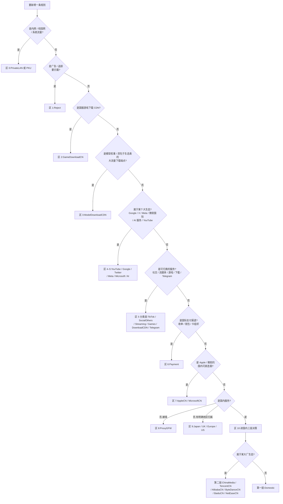

# 维护手册

面向日常操作:改一条规则、验证、发布、让它生效、出问题怎么查。
设计原理见 [ARCHITECTURE.md](ARCHITECTURE.md);module / script 开发见 [DEVELOPMENT.md](DEVELOPMENT.md)。

---

## 0. 日常回路

```
改 lists/*.list  →  python3 tests/runsuite.py  →  ./update.sh "<msg>"  →  客户端刷新
     ↑                        │
     └────────── 断言红了就回去改 ──┘
```

只碰 `lists/`。`clash/` 是派生产物,`tests/` 只在改判定逻辑时才动,`update.sh` 平时不需要改。

---

## 1. 新增一条规则:该放进哪张表

### 1.1 决策树



> 注:Reject 已在 conf 区 1 启用(`REJECT`,位次全链最前),**收录即抢占**。新增条目前先确认不会误伤正常服务;埋点 / 统计 / 归因 / 推送 / 崩溃 APM / 推荐类域是刻意放行的,勿再往里收,宽后缀一律禁收。

### 1.2 两步定位

**第一步 —— 按 0–10 十一区定位「区」**:见上图,也见 [ARCHITECTURE.md §2](ARCHITECTURE.md) 的完整规则序表。判断依据是**语义归属**,不是"哪张表看起来顺手"。

**第二步 —— 若落在区 10,再按三层定位「层」**:

| 情况 | 去处 |
|---|---|
| 临时补丁、上游没覆盖、需要立刻生效的特例 | **Domestic**(第一层) |
| 明确属于腾讯 / 阿里 / 字节 / 百度 / 网易 / 国内媒体 | 对应**厂商细分表**(第二层) |
| 国内域名长尾 | **不手工加**。ChinaDomain 是机器管理的整表刷新层,手写条目下次同步就没了 |

### 1.3 唯一归属与级联去重

**一个域名 / IP 在全链中只能出现在一张表里。**

新增之前先确认它没有已经被前面的表认领:

```bash
grep -rn "example.com" lists/
```

如果它已经在更靠前的表里出现,那条才是生效的;在后面的表里再写一遍不会生效,只会制造"改了没反应"的假象和后续维护的困惑。

**级联去重**的顺序就是 conf 顺序:靠前的表拥有归属权,靠后的表必须删掉重复条目。要改变一个域名的去向,做法是**从旧表删掉、在新表加上**,而不是在新表补一条了事。

### 1.4 写规则时的硬性要求

- **IP 类规则(`IP-CIDR` / `IP-CIDR6` / `GEOIP` / `IP-ASN`)必须带 `no-resolve`。** 没有例外。原理见 [ARCHITECTURE.md §4](ARCHITECTURE.md)。
- **全类型 `USER-AGENT` / `PROCESS-NAME` / `URL-REGEX` 一律禁止**(D7,纯域名+IP 架构)。已由 `tests/allowlist.json` 顶层 forbidden 段 + audit **A8** 机器强制:出现即 P0 且不可豁免。历史上的 PROCESS-NAME 大小写变体、宽 UA 均已全库移除,勿以任何理由带回。
- 关键词类规则慎用。已删除的关键词(`google` / `facebook` / `porn` / `akadns.net` / `ms` ccTLD / `paypal` / ChinaDomain 尾部 9 条品牌词)全部登记在 forbidden 段,回流即 P0。新增 DOMAIN-KEYWORD 必须有标签边界——优先改用 DOMAIN-WILDCARD 锚定(如 `*-ad.a.yximgs.com`、`dnserror.*`),别再加无边界的宽口径子串。
- **宽 `USER-AGENT` 一律不收。** UA 规则是全域生效的:它不看域名,只看 User-Agent,一条宽 UA 就能把该 app 访问的**任何**域按本表策略处理 —— 境外域被打直连、国内域被打代理。2026-08-30 审计已把 `Microsoft*`、`hide*`、`TeamViewer*`、`QQ*`、`TIM*` 五条从 `ChinaDomain.list` 删除并写进 D11 合并排除表,**再生 ChinaDomain 时必须过滤**(见 [ARCHITECTURE.md §6 D11 附](ARCHITECTURE.md))。同理删掉了 `TencentCN.list` 的 `MicroMessenger*` / `WeChat*`。
  别用「在更早的表加一条对冲 UA」来救 —— 任何位置的对冲都会误伤别的表,这条路已经论证死了。

---

## 2. 本地验证

### 2.1 场景回归(改完必跑)

```bash
python3 tests/runsuite.py
```

跑 `tests/scenarios/*.json` 里的 **189 个真实场景**、**2269 条断言**,其中 **915 条是 DNS 泄漏断言**。

**输出怎么读**:每条断言失败时会告诉你三件事 —— 哪个场景、期望落到哪个策略、实际落到了哪个策略。定位方法:

1. 实际策略比期望的**更靠前**(比如期望流媒体、实际是 Google-X-Meta-MS)→ 有一张**更前面的表抢跑**了。去那张表里找到抢跑条目,删掉它(唯一归属原则),而不是在后面的表里加。
2. 实际策略比期望的**更靠后**(比如期望 DIRECT、实际落到 Final)→ 该域名**没被任何表认领**,按 §1 决策树补进正确的表。
3. **DNS 泄漏断言失败** → 一定是某处引入了**无 `no-resolve` 的 IP 规则**。用 grep 找出来补上:
   ```bash
   grep -rnE '^(IP-CIDR|IP-CIDR6|GEOIP|IP-ASN),' lists/ | grep -v 'no-resolve'
   ```
   这条命令的输出**应当为空**。

### 2.2 静态审计(排查结构问题时跑)

```bash
python3 tests/audit.py --check all
```

跑 A1–A10 十项结构性检查(判据清单见 [ARCHITECTURE.md §7](ARCHITECTURE.md);A8 为 forbidden 回流门禁,命中即 P0 且不可豁免)。发布闸门用的是更严格的形式:

```bash
python3 tests/audit.py --check all --fail-on P1
```

`--fail-on P1` 表示 P1 级问题直接判定失败。审计报出的问题如果属于**既定设计裁决**(见 [ARCHITECTURE.md §6](ARCHITECTURE.md)),正确做法是确认它已经在 `tests/allowlist.json` 里被豁免,**而不是去"修"那条规则**。

### 2.3 在线核对(可选)

```bash
python3 tests/live_check.py
```

对着**运行中的 Surge 实例**验证真实落点,用于复核离线引擎的近似结论(尤其是 `GEOIP,CN` 用 `ChinaIP.list` 近似所带来的边界差异)。

**前提:conf 必须开启 http-api。** 没开的话脚本连不上,这不是脚本的 bug。

---

## 3. 发布流程

### 3.1 一条命令

```bash
./update.sh "<commit message>"
```

### 3.2 内部拆解

| 步 | 动作 | 失败会怎样 |
|---|---|---|
| 0 | **分支守卫** —— 只允许在 `main` 上发布 | 非 main 立即退出,不产生任何提交 |
| 0.5 | **ChinaIP 折叠漂移检查** —— `tools/collapse_cidr.py lists/ChinaIP.list --check` | 上游再生后未折叠 → 中止(先跑无参折叠再发布) |
| 1 | **闸门 A** —— `tests/audit.py --check all --fail-on P1` | 中止,不 commit |
| 2 | **闸门 B** —— `tests/runsuite.py` | 中止,不 commit |
| 3 | **clash 再生** —— `tools/surge2clash.py` 事务式重建:全量解析校验 → 临时目录生成 → 逐文件原子换入 | 未知规则类型**先报全清单再中止**,正式 `clash/` 零触碰(全有或全无);另有 `--check` 只比对不写入,0=一致/1=漂移/2=输入违规 |
| 4 | **commit** —— 带上你传入的 message | — |
| 5 | **push `HEAD:main` + 远端 SHA 校验** —— push 后 fetch 并比对 `origin/main == HEAD` | push 失败或校验不过 → exit 1,**不刷 CDN**(防把未发布内容刷上边缘) |
| 6 | **purge** —— **增量**调用 jsDelivr purge 接口:只处理本次 push 实际变更的分发文件,purge 前先比对 CDN md5,已一致的直接跳过;diff 中的**删除项**同样发 purge(全量候选集 **69 个**:`lists/` 34 + `clash/` 34 + `clash/rule-providers.yaml`) | 见 §5.2 |
| 7 | **md5 复验 + 三态收尾** —— 只复验本轮真正发出过 purge 的文件,收尾打印 `STATUS:` 行 | 存在限流 / purge 失败 / 拉取失败 / 复验不一致 → `PUBLISHED_BUT_UNVERIFIED`,**exit 1**,按提示补刷 |

**三态语义**:`VALIDATED_NOT_PUBLISHED`(无分发变更)与 `PUBLISHED_AND_VERIFIED` 退出码为 0;`PUBLISHED_BUT_UNVERIFIED` 一律 exit 1 —— 退出码即结论,别只看输出里有没有"完成"字样。

**双闸门的意义**:任何一个闸门不过,流程在 commit 之前就中止。这保证了仓库里不会出现"提交了但没通过验证"的状态,`main` 永远是可发布的。

### 3.3 CDN 缓存行为

jsDelivr 对 `@main` 分支路径有边缘缓存,**push 不等于生效**:

- 不 purge 的话,CDN 可能持续返回旧内容,最长约 **12 小时**才自然过期。
- `update.sh` 的第 6、7 步就是为此存在:先主动 purge,再用 md5 确认 CDN 已经吐出新内容。
- md5 全对 = 发布真正完成;有文件对不上 = 这次发布还没落地。

---

## 4. 让改动立即生效

发布完成(md5 全绿)之后,客户端还要重新拉一次远程资源。

### Surge

- 打开 Surge 的**「外部资源」(External Resources)** 面板,里面列出了所有远程 RULE-SET 及其上次更新时间;执行更新即可拉取新内容。
- 或者直接**重载配置**,Surge 会重新加载全部外部资源。
- 判断是否生效:在「外部资源」里看目标 list 的更新时间是否刷新;或用「请求」/「规则」测试面板试一个已知域名,看落点是否符合预期。

### Clash Verge Rev / Mihomo

- rule-providers 按各自的 `interval` 自动刷新;要立刻生效就**手动触发更新**,或**重载 / 重启内核**让 provider 重新拉取。
- 注意 provider 是**异步初始化**的,重载后需要等约 10 秒才能读到完整的 `ruleCount`(见 [ARCHITECTURE.md §5.3](ARCHITECTURE.md))。

---

## 5. 故障排查

### 5.1 断言失败

见 §2.1 的三类读法。补充几个常见误判:

- **"这条规则明明写了却不生效"** → 九成是被前面的表抢跑。`grep -rn "<域名>" lists/`,看它是不是在更靠前的表里也出现过。
- **"审计报了问题,但那是故意的"** → 对照 [ARCHITECTURE.md §6](ARCHITECTURE.md) 的设计裁决表;属于既定裁决的,确认 `tests/allowlist.json` 里有豁免,不要改规则。

### 5.2 CDN 内容不一致(md5 校验报未刷新)

按顺序排查:

1. **push 真的成功了吗** —— `git log origin/main --oneline -1` 看远端最新 commit 是不是你刚才那条。
2. **重跑一次** —— purge 有时需要一点传播时间,重新执行 `update.sh` 会再 purge 再校验一遍。
3. **等自然过期** —— 实在刷不动,`@main` 路径的缓存最长约 **12 小时**过期。这期间旧内容仍可用,不会中断服务,只是新规则还没铺开。
4. **确认文件集合** —— 全量候选是 69 个文件(增量模式下只处理本次变更的那些)。如果新增或删除了 `.list`,这个集合会变,需要同步核对 `update.sh` 里的文件收集逻辑。
5. **被限流了** —— 同一路径高频 purge 会被 jsDelivr throttle:受理但不执行,重置窗口约 1 小时。`update.sh` 会如实报告剩余秒数,等窗口过去再重跑即可,不要盲目重发。

### 5.3 `live_check.py` 连不上

conf 没开 http-api。这是前置条件,不是脚本故障。

### 5.4 布局重构后的路径类报错

`tools/surge2clash.py` 与 `tests/engine.py` 都需要正确指向 `lists/`。如果报"找不到规则文件":

- `surge2clash.py` 的规则目录应指向 `../lists`(相对脚本自身,即仓库根下的 `lists/`)。
- `engine.py` 由 conf 路径推导 `rules_dir` = `<conf 同级>/rules/lists/`。这里硬编码了「仓库目录名必须叫 `rules`、且与 `Surge.conf` 同级」的约定 —— 目录改名或另置时,`audit.py` 用 `--rules` 显式指定规则目录;`runsuite.py` 没有 `--rules` 参数,用 `--conf` 指定 conf 路径让引擎重新推导。
- `engine.py` 对 `ChinaIP.list` 的硬引用(用作 `GEOIP,CN` 近似)经由 `rules_dir` 拼接,目录指对了即自动跟随,无需单独适配。

---

## 6. 红线清单

违反以下任何一条,后果都是静默的 —— 不会立刻报错,但会在某个时刻造成难查的问题。

| # | 红线 | 后果 |
|---|---|---|
| 1 | **勿手工编辑 `clash/`** | 下次 `update.sh` 全量覆盖,改动无声消失 |
| 2 | **勿引入任何 USER-AGENT / PROCESS-NAME / URL-REGEX 规则**(D7,forbidden 段机器强制) | audit A8 直接 P0 拦发布;绕过则 UA/进程规则全域生效错分流、Clash 派生剔除造成双端分叉 |
| 3 | **勿引入无 `no-resolve` 的 IP 规则** | DNS 泄漏 + 延迟惩罚 + 错误分流,915 条断言就是为它设的 |
| 4 | **勿往 conf 写 MITM 的 `enable` 键** | Surge 规范化时会把它移除,反复写只是白费功夫。MITM 开关在 GUI 运行态,conf 只保留 `h2=true` |
| 5 | **手工条目勿加 ChinaDomain** | 该表整表机器刷新,手写条目会被无声抹掉。要加就加进 Domestic 或对应厂商细分表 |
| 6 | **勿 `git add` `reference/`** | 它是本地参考库,已在 `.gitignore` 中,不入库 |
| 7 | **勿把 `Surge.conf` 的节点段 / MitM 段具体内容写进本仓库任何文件** | 这是**公开仓库**。节点地址、预共享密钥、CA 证书及其口令一旦提交,历史里就永久存在了。文档中提到 conf 只讲结构与 `[Rule]` 区 |
| 8 | **勿开 `use-local-host-item-for-proxy`**(conf 已显式写死 `= false`) | 一旦为 true,目标域只要存在本地 DNS mapping,Surge 就会**用 IP 而不是域名**建立代理连接;与本 conf 的 `read-etc-hosts = true` 叠加,恰好制造出零本地解析架构禁止的行为。**915 条断言看不见这个键**(它们只检 IP 规则的 `no-resolve`),只能靠显式写死 + 本条红线守。同理 `allow-dns-svcb` 保持缺省 false,见 [ARCHITECTURE.md §4.5](ARCHITECTURE.md) |
| 9 | **勿在 `lists/` 的任何一行上引入 `extended-matching`** | 官方语义:set 文件里**任意一行**域名规则带它,**整张表**的域名规则都会打开扩展匹配。一行就能改掉最大 10.6 万条那张表的匹配语义,而这是上游合并极易带进来的。开关面只有 conf 的 RULE-SET 行(现 11 处),`lists/` 行级必须恒为 0;该开在哪几张表见 [ARCHITECTURE.md §2「判据 R」](ARCHITECTURE.md) |

---

## 7. 备份点与回滚

### 7.1 已有备份点

| 备份点 | 形式 | 对应状态 |
|---|---|---|
| `pre-restructure-20260829` | git tag | 2026-08-29 目录重构**之前**的仓库快照(落后当前 HEAD 多个提交) |
| `Profiles/Backup/` 下的 1 个历史 conf 备份 | 文件 | 仅 conf,不含规则;文件名带厂商标识,按 [ARCHITECTURE.md](ARCHITECTURE.md) D9 既不入库也不在文档中具名 |

> 2026-08-31 核对:此前登记的 `pre-blackmatrix7-merge-20260825/`、`pre-audit-fix-20260825/` 两个快照目录已随 2026-08-30 的备份清理删除,不再存在——用户裁决为本地不留敏感备份。规则内容的回滚依赖 git 历史(见 7.2),目录快照只是可选加速手段。

做重大合并或结构调整之前,优先打 git tag(`git tag pre-<变更名>-<YYYYMMDD>`);如需目录快照,命名 `Profiles/Backup/pre-<变更名>-<YYYYMMDD>/`,用完即清。注意:目录快照只覆盖规则文件,而转换器/测试/文档也可能随版本变化,完整回滚以 git 提交为准。

### 7.2 回滚

规则内容出问题时:

1. `git revert <commit>` 或 `git checkout <good-commit> -- lists/` 把 `lists/` 恢复到已知良好状态。
2. **重新走一遍 `./update.sh "revert ..."`** —— 关键在于必须重新 purge。只把 git 回滚而不 purge,CDN 上仍是坏内容,客户端还会继续拉到它。
3. 跑 `runsuite` 确认回到全绿。

conf 侧出问题时,用 `Profiles/Backup/` 下对应的备份替换,Surge GUI 重载即可。

---

## 8. 裁决登记

已生效、但不值得占用规则表头注释的操作性约束,逐条登记在此。与 [ARCHITECTURE.md §6](ARCHITECTURE.md) 的设计裁决表、`tests/allowlist.json` 的审计豁免互补 —— 那两处说明「为什么规则长成这样」,这张表说明「下次维护时不许做什么」。

| 表 | 约束 |
|---|---|
| AI | AI 站分档收录:A / B 档收(自研模型、自有推理面、主流 agent 与工具链),**C · D 档一律不收**。`bolt.com` 是支付公司(与 bolt.new 无关),明确禁收 |
| AI | AI 应用的更新 / 分发包(如 `releases.warp.dev`)随应用留 AI 组,**不拆去下载组** —— 已成先例,勿再按「下载域归 DownloadCDN」搬走 |
| AI | `aws.dev` / `console.aws.a2z.com` 留 AI.list;`awsapps.com` / `awsstatic.com` / `sso.amazonaws.com` 属通用 AWS 客户域,归 ProxyGFW —— 其中 `sso.amazonaws.com` 由 ProxyGFW 的 `amazonaws.com` 宽兜底承接,**勿单列**(单列即同表死条目,2026-08-31 已删) |
| ChinaDomain | 整表再生后须重新过滤 **17 条已删域**:`123du.cc` `23us.so` `biyuwu.cc` `emsec.hk` `hanfan.cc` `hostloc.me` `locvps.com` `mht.la` `mojie.app` `mojie.co` `nt.app` `xs7.la` `yiruan.la` `zzzzzz.me`(已转 ProxyGFW)+ `mojie.kim` `mojieai.com` `springerlink.com`(仅删除,落 FINAL)—— 国内 DNS 已被投毒或站点境外托管,直连必超时 |
| ChinaIP | 数据源必须用 blackmatrix7 `ChinaIPs`(IPv4 + IPv6 全量)。曾用的不完整源 IPv4 覆盖率仅 78.6%,缺 `59.192.0.0/10`、`43.0.0.0/10`、`175.64.0.0/11` 等已核实的 CN 大段,**不可回退换源** |
| Domestic | CA 吊销 / AIA 端点集中收在本表直连(TLS 握手关键路径,soft-fail)。但 `ocsp.usertrust.com` / `ocsp.entrust.net` **刻意不收** —— ProxyGFW 的 `usertrust.com` / `entrust.net` 后缀位次更前,收了也只是死条目;走代理 → Final 在 soft-fail 下无害 |
| Domestic | 已删的境外托管 / 直连不可达域勿再收回:`id6.com` `mi-idc.com` `jstarkan.com` `mrw.so` `sifou.com` `lancdn.com` `oneplus.net`(落 FINAL)、`linux.do` `linuxdo.org` `futu5.com`(已转 ProxyGFW) |
| MicrosoftCN | 微软自家 CA 端点(`crl` / `ocsp` / `oneocsp.microsoft.com`)归 **MicrosoftCN**,不归 Domestic —— Domestic 位次在 ProxyGFW 的 `microsoft.com` 后缀之后,收了不生效 |
| DownloadCDN | 顶域与其伴生子域必须**成对处理**:顶域移入生态表时,同步删掉本表的伴生子域,否则留下永不命中的死规则 |
| DownloadCDN | 刻意留在本表的真·下载面:`downloads.lemonsqueezy.com`、`public-files.gumroad.com`,以及 Edge / Defender / VS Code 的更新域 —— 勿以「该归它的生态表」为由搬走 |
| Microsoft | **勿把 `DOMAIN-SUFFIX,microsoft.com` 整条搬进 Microsoft.list** —— 它位次先于 MicrosoftCN,会一次性遮蔽后者 **45 条**国内直连域。同理 `cloud.microsoft` 整 gTLD 不收(会把 Office Web 与 MicrosoftCN 直连面拽进代理),只收 `m365.cloud.microsoft` 这类精确子域 |
| Meta | 明确不收:`llama-api.com`(Cloudflare 上的第三方)、`metaquest.com`(无解析)、`horizonworlds.com`(不落 Meta IP) |
| Google | `.google` / `.goog` gTLD 后缀已兜底 `deepmind.google` / `labs.google` / `ai.google` 等 AI 门面,无需单列 |
| ModelDownloadCDN | 定位是「须先于生态表匹配的大流量下载端点」。日后同类(如容器镜像层)也归本表,不要为此在 conf 另开新区 |
| Payment | **明确拒绝且勿再提**:revolut / remitly / safecharge / dlocal / rapyd / westernunion / moneygram / worldline / shop.app / checkout.shopify.com —— 银行类归区域表;Shopify 结账域与店铺同会话,单独切出反而自制 3DS 风控 |
| Payment | 生态自有支付(alipay / unionpay / Apple Pay / 微信支付 / Google Pay)留在各自生态表,**不并入 Payment.list** |
| Payment | `Payment` 策略组必须是 `select` 类,**不可改成 url-test / fallback 等自动测速组** —— 出口漂移会直接触发 3DS 重验与拒付 |
| ProxyGFW | `amazonaws.com` / `microsoft.com` / `azureedge.net` 等宽后缀留在本表是**刻意的分层兜底**(具体子域已由前位表承接),审计报「重复 / 遮蔽」属预期,勿删 |
| Reject | 上游那 42 条**无注解的劫持 IP** 不收 —— 条目陈旧,且部分落在中国 IP 段,收进来会误伤;本表 IP 区只留 HTTPDNS 服务 IP |
| SocialOthers | Discord 只收实际在用的功能域;上游那批防御性注册域不收 |
| US | 银行 / 券商 / 征信域(chase / citi / wellsfargo / schwab / equifax 等)留 US.list —— **不算支付渠道**,勿并入 Payment |
| 全库 | 「必须持续不存在」的规则(全类型 USER-AGENT / PROCESS-NAME / URL-REGEX、D11 上游排除项、已删品牌关键词)登记进 `tests/allowlist.json` 顶层 **forbidden 段**,由 audit A8 强制(命中即 P0 且不可豁免)。**勿再用 preventive exemption 表达「命中即删」语义**——exemption 只表达「允许存在」(2026-08-31 语义拆分) |
| Twitter | **Cursor/Anysphere 全家归 AI.list**(2026-08-31 更正 08-30 旧裁决):Cursor ToS 主体是 Anysphere, Inc.,独立公司;「Grok Bot 后端曾用 cursor 基建」推不出所有权,勿再并回 Twitter.list。`x.ai` / `grok.com` 仍属 xAI 留 Twitter |
| AI | `static.cloudflareinsights.com` **禁收**(2026-08-31 更正 08-30 B2 裁决):它是 Cloudflare Web Analytics 性能 beacon,与 Turnstile 验证码无关,「同出口降验证码率」不成立,落 FINAL;`challenges.cloudflare.com`(真 Turnstile,ChatGPT/Claude 登录链)继续留 AI |
| TikTok | `snapkit.com` 全域(Snap Kit,Snap 官方资产;曾散落 `api.snapkit.com`@TikTok 与 `sdk.snapkit.com`@DownloadCDN)与 `cocacola.co.jp`(日本可口可乐)**勿再收**——Snap 域删除后与 Snap 生态同落 Final,后者已迁 Japan.list;`courses.snapsolve.com`(字节历史教育产品)列观察项,无命中证据时下轮清理 |
| Domestic | `qwenlm.ai` 归 AI.list(跳转 `chat.qwen.ai`,国内厂商国际站统一代理),勿收回直连层;`digicert.com` 整域自 AppleCN 迁入本表 CA 段(CA 所有权不登记在厂商表),`hnagroup.com` 为 ChinaDomain 删 `hnagroup` 关键词的精确承接 |
| ChinaDomain | 整表再生后须重新过滤**尾部 9 条品牌关键词**:`.tmall.com` `alicdn` `alipay` `aliyun` `baidu` `hnagroup` `officecdn` `taobao` `weibo` —— 已入 allowlist forbidden 段由 A8 机器强制,核心域由厂商表精确后缀承接 |
| Payment | PayPal 只收官方精确后缀(`paypal.com` / `paypal.me` / `paypalobjects.com` / `paypal.cn` / `paypalcorp.com`);`DOMAIN-KEYWORD,paypal` 已入 forbidden 段,**勿再用品牌子串收支付渠道** |
| Games | `sony.com` 勿收(集团总域,覆盖相机/影视/半导体,非游戏会话面;PlayStation/SIE 域已单列);GCP `35.192.0.0/12` 一类**共享云客户段勿收**——云平台所有权≠业务所有权 |
| Meta | AWS `18.194.0.0/15` 勿收(AWS eu-central-1 共享客户段,非 Meta 专网;Meta 自有 AS32934 网段不受影响) |
| Google | `IP-ASN,396982` 勿收(Google Cloud 通告**客户**前缀所用 ASN,代表 GCP 租户不代表 Google 第一方产品;第一方 fallback 已有 AS15169 等) |
| Reject | DOMAIN-KEYWORD 必须有边界:结构化片段用 DOMAIN-WILDCARD 锚定(如 `*-ad.a.yximgs.com`、`dnserror.*`、`hostingcloud.*`),**勿新增无边界子串**;剩余 6 条特异词(`adsyndication` `adtarget.` `advertmarket` `nimiqpool` `packetsdk` `pangolin-sdk-toutiao`)为观察项,有命中/误杀证据后改精确后缀或删除 |
| MicrosoftCN | ~~`1drv` / `onedrive` / `skydrive` 观察~~ 2026-08-31 二轮已完成迁移:上游 OneDrive 表对撞恢复精确后缀(`1drv.com/.ms`、`onedrive.com`、`skydrive.wns.windows.com`)后删除,已入 forbidden;防御性注册域(`onedrive.co/.eu` 等)刻意不收 |
| 全库 | **二轮关键词迁移完成(104→8)**:所有删除的宽关键词已入 forbidden 段(A8 强制)。仅存 8 条为登记在案的观察项——Reject 6 条特异词、AppleCN `smp-device`(候命中样本)、ProxyGFW `sci-hub`(品牌镜像语义暂留);其去留凭命中/误杀证据裁决,勿默认续期 |
| DownloadCDN | `unpkg.com` **保留**(2026-08-31 裁决):与 jsDelivr/cdnjs 同为单一注册者的包内容 CDN,无租户子域形态,不属多租户平台清理范围;三者同出口由场景锁定 |
| DownloadCDN | 多租户托管/对象存储平台宽后缀 13 条(github.io/vercel.app/pages.dev/cloudfront.net/blob.core.windows.net/s3.amazonaws.com 等)**永久禁收**,已入 forbidden;平台上的具体第一方资产用精确 host 收进对应生态表 |
| 全库 | 通用 SaaS 组件域(Trustpilot/Algolia/Zendesk/Optimizely/Braze/AdobeDTM/Kochava/OneTrust/CookieLaw/conductrics)**不归任何业务表**,与调用方站点解耦落 FINAL;云区域通用后缀(`us-west-2.amazonaws.com`/`execute-api.*` 等)同理,第一方网关只收实证精确 host(如 HBO GO Asia 的 `44wilhpljf.execute-api…`) |
| Games | FiveM/Cfx(`fivem.net`/`cfx.re`)与万代账号(`bandainamcoid.com`)整族归 Games(游戏平台/账号链语义),勿再散落下载表;Epic/Steam 关键词已改上游对撞的精确资产(`epicgames.com/.dev`、`steambroadcast.akamaized.net`、`steamstore-a`/`steamuserimages-a.akamaihd.net`) |
| YouTube | `youtubei` / `youtube` / `youtubeembeddedplayer` 三个 **YouTube 专属 googleapis 子域归 YouTube.list**(App 主 API 端点,会话完整性;位次先于 Google 无冲突);通用 `googleapis.com` 面仍归 Google,勿扩 |
| AppleCN | Akamai/akadns CNAME 调度域(`apple.com.edgekey.net` 等 4 条)用 **DOMAIN-SUFFIX**(点边界,同表 `itunes.com.edgekey.net` 先例),勿用 keyword 或无边界 wildcard;`testflight` 面由 `apple.com` 宽后缀承接勿单列 |
| Streaming | Abema 的 akamaized 精确 host(`abematv`/`linear-abematv`/`vod-abematv.akamaized.net`)与 `abematv.co.jp` 归本表,与既有 `ds-vod-abematv` 同链;`akamaized.net`/`akamaihd.net` 宽后缀仍禁收 |
| ChinaDomain | **再生回收清单**(2026-08-31 二轮,删宽关键词的连带):`kkgithub.com`/`hellogithub.com`/`githubim.com`/`githubshare.com`、bilibili 系杂域、qiyi 系杂域、`eqoavtbu.com`/`51drv.com` 等约 26 域曾被宽关键词级联去重挤出本表,现落 FINAL(走代理可用,无功能损失)。**下次上游再生时它们会自然回收为 DIRECT,属预期,勿当回归**;也勿手工补进 Domestic 污染手工层 |
| Streaming | `nowtv100`/`jooxweb-api` 已改锚定 wildcard 但无上游 host 样本、TikTok 5 条尾点 CNAME 展平 wildcard(`musical.ly.*` 等)命中率存疑——均凭命中统计决定去留,零命中 90 天可删 |
| PrivateLAN / PKU | **区 0 表禁收未注册域**:区 0 优先级高于 Reject,一条未注册域被抢注即等于一条免疫全库拦截层的 DIRECT 白名单(`pkuiot.com` whois `No match`、`bdwm.net` 已是 GoDaddy 停放页,2026-08-31 均已删)。新增前须确认 whois 有主体、NS / 起源 ASN 属预期机构 |
| PrivateLAN | 与 Surge 内建 `LAN` 的重叠是**必要的**,勿当冗余删:①位次决定一切(本表在区 0 第 2 条,内建 `LAN` 在 ChinaIP 之后);②`198.18.0.0/15` 是 fake-IP 段,必须在区 0 判 DIRECT,否则 fake-IP 回环被后续规则接管;③覆盖面更广(`0.0.0.0/8`、CGNAT、TEST-NET、多播,内建集不含) |
| Reject | A 组 3 条 HTTPDNS(`dnspod.meituan.httpdns.start.qcloud.com` / `httpdns.qcloud.com` / `httpdns-v6.gslb.yy.com`)**必留**:删除后落点实测是 **DIRECT** 而非 FINAL(被 `TencentCN` 的 `qcloud.com`、`Domestic` 的 `yy.com` 宽后缀接住),不满足 A 组「删后落 FINAL」的定义前提;两个厂商域是长期持有的**活**域,端点随时可重开 → 静默变直连并绕过整套域名分流。**A 组实删 38 条,不是审计写的 41 条** |
| Reject | B 组 20 条 `.cn` 死域**必留**(`4336wang.cn` `58mingri.cn` `9s6q.cn` `dv8c1t.cn` `kualianyingxiao.cn` `ltheanine.cn` `minisplat.cn` `nbkbgd.cn` `sg536.cn` `sifubo.cn` `sifuce.cn` `sifuda.cn` `sifufu.cn` `sifuge.cn` `sifuji.cn` `sifuka.cn` `tt3sm4.cn` `urlaw.cn` `urlet.cn` `yihuifu.cn`):ChinaDomain 末位是整条 `DOMAIN-SUFFIX,cn`,删掉一条已 NXDOMAIN 的 `.cn` Reject 条目后,该域一旦被重新注册,落点由 `REJECT` 直接翻成 `DIRECT` —— 比留着死条目更危险。解除条件只有「`.cn` 整 ccTLD 兜底被收窄或移除」,在此之前下轮审计不得重提删除 |
| Meta | 防御 / 库存**停放域**一律不收。停放签名 = NS `a-d.ns.facebook.com` / `ns.instagram.com` / `ns.whatsapp.net`(或注册商 `RegistrarSEC LLC`)+ A 落 `57.144.0.0/14` **且主机号以 `.141` 结尾**(不止 `220.141` / `221.141`,CN 侧另见 `.64.141` / `.216.141`,签名写成定值会漏掉一半)+ HTTPS 无证书 + HTTP 301 回自身。原文存 `reference/`,不入库不分发 |
| Meta | O 档 28 条 Meta 开源项目站**刻意保留在本表**:归属确属 Meta,虽托管在 GitHub Pages / Cloudflare、与 AS32934 无关。保留是为避免下轮反复,不视为定位失真 |
| Meta | IP 区只收第一方段:共享云(AWS / SoftLayer / DigitalOcean)、他司段(LY Corp / LINE)、Google 段一律不收,即使上游带来。`129.134.0.0/16` / `157.240.0.0/16` 合并的依据是 **ARIN 整段 NetName `THEFA-3`**,不是「AS32934 在 `129.134.128.0/17` 内有子前缀通告」(实测 0 条) |
| MicrosoftCN | `onedrive.live.com` 是对同表宽后缀 `live.com` 的**刻意窄豁免**(成因:CN 侧解析投毒致个人版 OneDrive 直连不可用)。禁止扩宽为 `live.com`,禁止删除;`office.live.com` / `view.officeapps.live.com` / `g.live.com` 必须仍 DIRECT |
| MicrosoftCN | `msocsp.com` 属「**预置位**」而非热路径:apex 由微软 Azure DNS 自持(无重注册劫持风险),`ocsp.` / `oneocsp.` / `ocsp2.` / `www.` 四个子域现均双侧 NXDOMAIN(微软已迁 `oneocsp.microsoft.com`),但旧证书的 AIA / CRL URL 仍指向该域,一旦回流必须走 DIRECT(它不在 `microsoft.com` 之下,无规则即落 Final 走代理)。**零命中不作为删除理由** |
| Google | `IP-ASN,19527` / `IP-ASN,43515` 勿收:通告空间 98% 以上是 GCP **客户**段,与已登记的「`IP-ASN,396982` 勿收」同判据;第一方 fallback 由 `IP-ASN,15169` + 4 条 IP-CIDR 承接 |
| Google | `-cn` 族与 `.cn` 族**同源已在证书层证实**(同一张 `CN=*.google.cn` GTS 证书、81 个 SAN 同时覆盖两族);迁移按 `-cn` 可达性矩阵的 A/B/C/D 四组分批,**不可整族一次改** |
| Google | `www.googleadservices-cn.com` 在 CN 侧被置空(AliDNS `0.0.0.0` / 114DNS `127.0.0.1`,国际侧正常):该族若迁 DIRECT 必须单独排除这个 host,否则直连必然失败且**不会回退代理** |
| Google | `gstatic-cn.com` 的 apex 不是可用端点(证书 SAN 只有 `*.gstatic-cn.com`、无裸域,CN 与国际侧 apex 均 TLS 校验失败):该域的验收断言必须用真实子域,不得用 apex |
| YouTube | `IP-ASN,36040` 归本表:AS36040 零 GCP,全部是承载 YouTube 视频的 ISP 内嵌 GGC 缓存段,与「YouTube 专属资产归 YouTube.list」同源 |
| YouTube | 会话资产用 `DOMAIN` 精确形认领(`yt3` / `yt4.googleusercontent.com`、`jnn-pa.googleapis.com`),**不动 Google.list 的宽后缀**以保持唯一归属;由此产生的遮蔽信号由 allowlist exemption 承接 |
| Telegram | 两条第三方 `/32`(`139.59.210.98` = DigitalOcean 共享云、`196.55.216.167` = AfriNIC 无 RDAP 数据)按**观察制**保留,带 `last_verified=2026-08-31`,90 天零命中即删 |
| TikTok | `courses.snapsolve.com` 观察项**结案**:2026-08-31 取到停放硬证据(SOA `ns1.sedoparking.com`、A `64.190.63.222`)已删,从观察清单划掉 |
| ByteDanceCN | `bytedance.net` 已删(解析出 RFC1918 `10.8.6.210`,任何策略组都处理不了);同批备案:`musical.ly` / `ttoversea.net` / `tlivecdn.com` / `tlivepush.com` 的 apex 已被字节**主动置空**(`127.0.0.1` / `0.0.0.1`),下轮勿重复调查 |
| ModelDownloadCDN | 收录判据 = 「`curl -sI` 实测 302 Location 命中的 CDN host 族」,站点浏览与 API 归 AI.list。2026-08-31 复核:HF 已整体切 Xet 后端,现网落点是 `aws.cdn.hf.co` 族,`cdn-lfs.huggingface.co` 已死 |
| ModelDownloadCDN | `xethub.hf.co` 保留:apex 无 A 但 SOA / NS 活(Route53)且 `transfer.` / `cas-server.` / `cas-bridge.` 三子域在用,属**子域型域**,与 `Japan simg.jp` 同判据,勿按死条目删 |
| 全库 | **S3 族判别式**:`<bucket>.s3.<region>.amazonaws.com` 与 `<bucket>.s3.amazonaws.com` 是同一 bucket 的两种寻址形式,PSL PRIVATE 段收录全部该形态 ⇒ 注册边界,**任何表都不得以 `DOMAIN-SUFFIX` 收录**;第一方 bucket 只以精确 `DOMAIN` 收进对应生态表(样板:`AI.list` 的 `ppl-ai-file-upload.s3.amazonaws.com`) |
| 全库 | S3 的 forbidden 签名必须**锚定 `amazonaws.com`**(`s3.*.amazonaws.com` / `s3-*.amazonaws.com`),**不得写成 `s3*`** —— 全库另有 32 条第一方 `s3.<brand>` host(Figma / Brave / Producthunt / Envato / documentcloud…),它们不是租户边界。审计的「321 条」是纯前缀 grep 的**计数方法学错误**,真实 AWS 锚定族是 **280 条**;验收用判定签名,不用计数 |
| DownloadCDN | 多租户 S3 **兼容**端点同样禁收(与已删的 `linodeobjects.com` / `vultrobjects.com` 完全同构,只是厂商没给 PSL 提交条目):Backblaze ×5、Wasabi ×2、`s3.filebase.com`、`s3-website.cloud.ru`、`s3.yandex.net` 共 10 条已删。判据是**通配 bucket DNS 实测**(`dig zzprobe9x.<host>` 能解析 ⇒ virtual-hosted-style 多租户端点);对照的 22 条第一方 host 通配全部 NXDOMAIN,故保留 |
| Games | `steambroadcast.com` 禁收:2026-04-27 注册 / Registrar.eu / 注册人组织 Dynadot / Cloudflare NS,301 跳 `faceit.com` —— 真 Valve 域一律 MarkMonitor。真直播资产是 `steambroadcast.akamaized.net` |
| GameDownloadCN | Steam 国服 CDN 归属**收归本表**:`Domestic` 的 `steam.clngaa.com` / `steam.ksyna.com` 两条父后缀已删;本表对应把 `:26` 放宽为 `DOMAIN-SUFFIX,steam.clngaa.com`、把 `:4`(`DOMAIN,dl.steam.ksyna.com`,整族双侧 NXDOMAIN)直接删除,以收回当前对 ChinaDomain `clngaa.com` / `ksyna.com` 兜底的依赖 |
| AI | Intercom 四域(`intercom.io` / `intercomcdn.com` / `intercomassets.com` / `intercomcdn.io`)**统一归 AI**:消息通道与资产面同会话,必须同出口,勿再跨表分裂 |
| AI | `chatgpt.site` 保留:PSL PRIVATE 段收录,但条目由 OpenAI 自行提交(`security@openai.com`),注册者唯一,与 `oaiusercontent.com` 同源同理;A10 上线须为它预登记豁免,否则会被误报成多租户边界 |
| ProxyGFW | Mixpanel 以 `DOMAIN-SUFFIX,mixpanel.com` 一条**统一覆盖**全部区域端点(`api.` / `api-eu.` …);原窄条 `api.mixpanel.com` 已被其遮蔽,故一并替换而非并存 |
| DownloadCDN | Gigya 属**身份认证组件**而非下载面,已移出:绑到下载出口意味着任意使用 SAP CIAM 的站点登录都走「下载」组。与「参与支付风控决策链的指纹组件归 Payment」是同一把尺子的两端 |
| Payment | ThreatMetrix 只收 `DOMAIN-SUFFIX,online-metrix.net` **一个注册域**:`online-metrix.com` 与其他 TLD 归属未验证、刻意不收,`myonline-metrix.net` 一类由标签边界天然排除。理由是设备指纹上报必须与收单授权同出口(出口漂移正是它的检测信号)。**边界口径:参与支付风控决策链的指纹 / 反欺诈组件归 Payment,其余通用 SaaS 组件仍落 FINAL** |
| Domestic | CA 段补 `crl.sectigo.com` / `secure.globalsign.com` / `ocsp.verisign.com` 三条(TLS 握手关键路径,soft-fail 下走代理会拖长握手甚至静默降级);加前已确认 ProxyGFW 无 `sectigo` / `globalsign` / `verisign` 宽后缀遮蔽,形态沿用同表既有 `crl.globalsign.com` / `ocsp.sectigo.com` 的约定 |
| UK | **BBC 属地锁归本表**:BBC 品牌注册域全族(`bbc` gTLD / `bbc.co` / `bbc.co.uk` / `bbc.com` / `bbc.in` / `bbc.net.uk` / `bbci.co` / `bbci.co.uk` / `bbcmedia.co.uk` / `bbcpersian.com` / `bbcverticals.com`)的 owner 是 `UK.list` 而非 `Streaming.list` —— iPlayer 是英国属地锁,而「流媒体」是全局单选组且**无任何英国出口成员**,策略层表达不了「本服务需要某国出口」,故属地锁广播的正确 owner 是地区表 |
| UK | `DOMAIN-SUFFIX,bbc` 随品牌归本表:`.bbc` 是 BBC 独占的品牌 gTLD(注册局 NS `*.nic.bbc`),单租户无误伤面;留在 Streaming 只会成为唯一一条仍落美国出口的 BBC 名字。A10 做「单标签后缀一次性登记」时,这一条的 `file` 必须写 `lists/UK.list` |
| Streaming | BBC 挂在**第三方多租户 CDN** 上的精确 host(`bbcfmt.s.llnwi.net`、`bbc.mp-pxcdn.com`、9 条 `*-uk-live` 与 2 条 `*-ww-live.akamaized.net`)**刻意留本表**,不随品牌域迁 UK —— 它们的注册域属 Limelight / Piksel / Akamai(同 `llnwi.net` 下还住着 DAZN JP ×2、HBO Max、Viki),拆单个租户前缀会破坏该注册域的一致处置。此边界若要推翻,必须**整体迁移这 12 条**并同步改 `kw_media.json` 与 `fix_regions_v2.json` 的对应断言,不得再单拆一条 |
| Streaming | `tubi.tv` 由 `DOMAIN,tubi.tv` + `DOMAIN,www.tubi.tv` 合并为 `DOMAIN-SUFFIX,tubi.tv`:原两条精确形让其他 `*.tubi.tv`(如 `api.tubi.tv`)无人认领落 FINAL,是**覆盖空洞**;`tubi.tv` 为 Tubi 独占注册域、非多租户,由 DOMAIN 升 SUFFIX 扩大的捕获面全部属于该服务本身,不触碰「宽后缀禁收」红线 |
| US | `tubi.io` 已删:顶域 `@8.8.8.8` 无 A 记录、`curl` 000,`@223.5.5.5` 返回**投毒地址**(指纹会漂移,勿按具体 IP 复核);唯一已知活体 host `production-public.tubi.io` 已由 Streaming 认领 |
| Japan | `paravi.jp` 的删除依据是「**品牌终止后的跳转壳**」,**不是**审计原文的「服务已下线、curl 无响应、规则永不命中」—— 2026-08-31 复测 301 → `www.paravi.jp` 200(Vercel 托管的 `/internal-redirect` 壳页),域名活着;Paravi 2023 并入 U-NEXT,承接域 `unext.jp` / `nxtv.jp` 已在同表,壳本身无日本属地锁,保留无收益。**边界**:`happyon.jp` / `tvnow.de` / `npostart.nl` 一类是**活服务的跳转域**(目标域在同表且服务仍在运营,跳转本身也须走对出口)→ 保留,勿当死条目删。两者不可混为一谈 |
| Streaming | `espnplus.com` 已删,同上判据:`www.` 302 → `plus.espn.com`、apex 无 HTTP 响应,跳转目标已被同表 `espn.com` 后缀认领,保留只会让一次用户导航中途换出口 |
| Europe | GEOIP 层与域名层**刻意不对齐**:`GEOIP` 只对裸 IP 会话生效,当前只覆盖 **CH / DE / FR / NL**(有出口的国家);域名层按实体枚举,含 BE / LU 与跨国实体。两层口径不同**不是缺陷**,勿为「对齐」而增删 GEOIP 行;要改 GEOIP 本身须先开 http-api(离线引擎无 MaxMind,判不了非 CN 的 GEOIP) |
| TencentCN | 自 2026-08-31 起是**纯域名表,不设 IP 区**:原 14 条腾讯云海外 `/24` 已删,全部由 `ChinaIP.list` 覆盖且同为 DIRECT,表头声明已同步。勿再回填 IP 段 |
| AppleCN | `smp-device` 观察项**结案**(已删):关键词观察项清单由 8 条降为 7 条,负例断言已固化 |
| ProxyGFW | 本表是**全库最宽的代理兜底层、策略即 `Final`**,多租户宽度在此层是设计而非缺陷 ⇒ A10(PSL 边界)按**整表**登记一条 `{"check":"A10","file":"ProxyGFW.list","rule":"*"}` 豁免,**不逐条登记那 37 条 PSL 后缀**(`herokuapp.com` / `duckdns.org` / `notion.site` / `azurewebsites.net` …);与「ChinaIP / ChinaDomain 机器层零手改整表豁免」是同一处理范式 |
| ProxyGFW | 再生与维护的验收基准是 **18 条承载集**,不按行数、不按与上游对齐判定;惰性部分的增减不作为回归。存活过滤器**必须给承载集开豁免** —— 它与 769 条死域清单的交集恰好 3 条(`666pool.cn` / `hasi.wang` / `bbs.tuitui.info`),这三条正因为后位有更宽兜底(`cn` / `wang` / `tuitui.info`)才成为承载条目。存在理由见 [ARCHITECTURE.md §2「区 8 的重定位」](ARCHITECTURE.md) |
| ChinaDomain | `kw_direct.json` 里 6 条再生回收域(`51drv.com` / `eqoavtbu.com` / `githubim.com` / `githubshare.com` / `hellogithub.com` / `kkgithub.com`)已改 `policy_in` **双态**:整表再生把它们收回 DIRECT 属预期,**不得当回归**,也不得为了让断言变绿把它们手工钉进 ProxyGFW |
| ChinaDomain | 同表 `blbilibili.com` / `bilibilihelper.com` / `qiyikeji.com` **不双态**:上游当前版本与 pin `65e8adf` 均无此域,再生不会回收,断言保持单态 `Final`;将来上游若引入,须先补实测再改双态,不得直接放宽 |
| 全库 | **D9 打码边界延伸到文件名**:带厂商标识的备份 conf **文件名**、线路商**网段名示例**同样受 D9 约束,公开文档与代码注释里一律用中性描述或 `EXAMPLE-…` 占位符 |
| 全库 | A8 有**作用域缺口**:`forbidden` 段没有 `file` / `not_file`,「必须只存在于某表」类裁决(Intercom / Mixpanel / Datadog 的跨表分裂)当前**无法机器强制** —— 需先扩展 `audit.py` 再登记,别把这类裁决当成已被守住 |
| 发布链 | `update.sh` 退出码契约补丁:「先验拉取失败 ∧ purge 成功 ∧ 复验 md5 一致」判定为发布成功,从 `fetch_fail_pre_n` 扣减后落 `PUBLISHED_AND_VERIFIED` / exit 0。**新增分发表首次发布的先验 404 走的就是这条路径,不再打红**;收尾文案按 404 与网络错 / 5xx 分组 |
| Surge.conf | **本轮不动 `[Proxy]` / `[Proxy Group]`**(用户待决)。四项已确诊未处置,下轮勿当新发现重报:①孤儿节点 —— 1 条链式条目既非任何组成员也非任何条目的 `underlying-proxy` 目标,而 22 个组全写 `include-all-proxies=0` ⇒ 永不可选;②9 处 `persistent` 全惰性 —— 官方只在 `load-balance` 组下定义该键,`select` / `smart` 写了无效,危害是**认知错误**(以为已有「按站点粘出口」能力);③`policy-priority` 未加引号 —— 今天可解析,加第二对且用逗号分隔时会被静默切分丢弃;④`Final` 组默认成员是家宽,与区 3「大文件走下载组不占家宽」方向相反 |

---

## 9. 相关文档

- [ARCHITECTURE.md](ARCHITECTURE.md) —— 规则序、三层设计、零本地 DNS 解析、设计裁决、测试体系
- [DEVELOPMENT.md](DEVELOPMENT.md) —— module / script 开发指南
- [../README.md](../README.md) —— 仓库总览与快速开始
- [../CHANGELOG.md](../CHANGELOG.md) —— 版本更新记录
