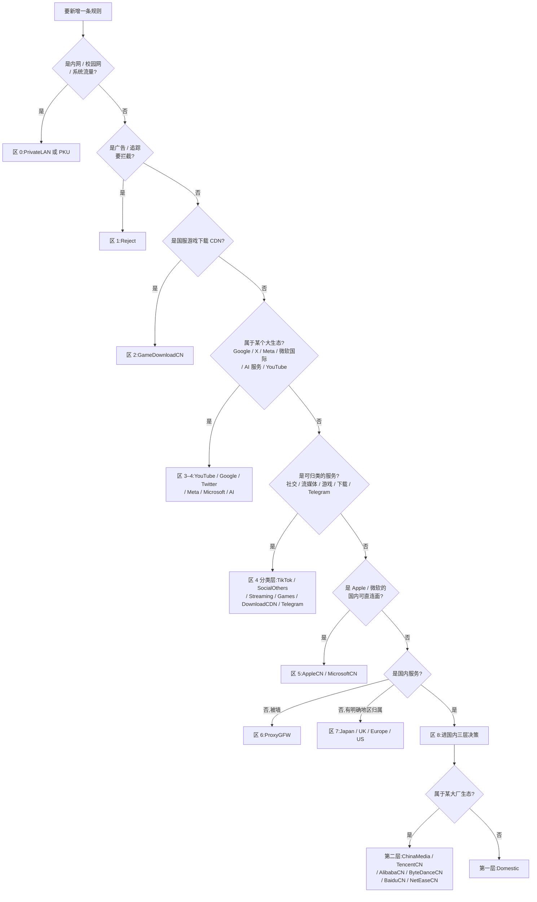

# 维护手册

面向日常操作:改一条规则、验证、发布、让它生效、出问题怎么查。
设计原理见 [ARCHITECTURE.md](ARCHITECTURE.md);module / script 开发见 [DEVELOPMENT.md](DEVELOPMENT.md)。

---

## 0. 日常回路

```
改 lists/*.list  →  python3 tests/runsuite.py  →  ./update.sh "<msg>"  →  客户端刷新
     ↑                        │
     └────────── 断言红了就回去改 ──┘
```

只碰 `lists/`。`clash/` 是派生产物,`tests/` 只在改判定逻辑时才动,`update.sh` 平时不需要改。

---

## 1. 新增一条规则:该放进哪张表

### 1.1 决策树



> 注:Reject 已在 conf 区 1 启用(`REJECT`,位次全链最前),**收录即抢占**。新增条目前先确认不会误伤正常服务;埋点 / 统计 / 归因 / 推送 / 崩溃 APM / 推荐类域是刻意放行的,勿再往里收,宽后缀一律禁收。

### 1.2 两步定位

**第一步 —— 按 0–8 九区定位「区」**:见上图,也见 [ARCHITECTURE.md §2](ARCHITECTURE.md) 的完整规则序表。判断依据是**语义归属**,不是"哪张表看起来顺手"。

**第二步 —— 若落在区 8,再按三层定位「层」**:

| 情况 | 去处 |
|---|---|
| 临时补丁、上游没覆盖、需要立刻生效的特例 | **Domestic**(第一层) |
| 明确属于腾讯 / 阿里 / 字节 / 百度 / 网易 / 国内媒体 | 对应**厂商细分表**(第二层) |
| 国内域名长尾 | **不手工加**。ChinaDomain 是机器管理的整表刷新层,手写条目下次同步就没了 |

### 1.3 唯一归属与级联去重

**一个域名 / IP 在全链中只能出现在一张表里。**

新增之前先确认它没有已经被前面的表认领:

```bash
grep -rn "example.com" lists/
```

如果它已经在更靠前的表里出现,那条才是生效的;在后面的表里再写一遍不会生效,只会制造"改了没反应"的假象和后续维护的困惑。

**级联去重**的顺序就是 conf 顺序:靠前的表拥有归属权,靠后的表必须删掉重复条目。要改变一个域名的去向,做法是**从旧表删掉、在新表加上**,而不是在新表补一条了事。

### 1.4 写规则时的硬性要求

- **IP 类规则(`IP-CIDR` / `IP-CIDR6` / `GEOIP` / `IP-ASN`)必须带 `no-resolve`。** 没有例外。原理见 [ARCHITECTURE.md §4](ARCHITECTURE.md)。
- **PROCESS-NAME 保留大小写变体。** `Claude` 和 `claude` 都要在,那是刻意的跨平台覆盖,不是重复。
- 关键词类规则慎用。合并排除表里的那几个(`DOMAIN-KEYWORD,google`、`akadns.net`、`stripe`、`ms` ccTLD、porn / facebook 等)是踩过坑的,别再往里加同量级的宽口径关键词。
- **宽 `USER-AGENT` 一律不收。** UA 规则是全域生效的:它不看域名,只看 User-Agent,一条宽 UA 就能把该 app 访问的**任何**域按本表策略处理 —— 境外域被打直连、国内域被打代理。2026-08-30 审计已把 `Microsoft*`、`hide*`、`TeamViewer*`、`QQ*`、`TIM*` 五条从 `ChinaDomain.list` 删除并写进 D11 合并排除表,**再生 ChinaDomain 时必须过滤**(见 [ARCHITECTURE.md §6 D11 附](ARCHITECTURE.md))。同理删掉了 `TencentCN.list` 的 `MicroMessenger*` / `WeChat*`。
  别用「在更早的表加一条对冲 UA」来救 —— 任何位置的对冲都会误伤别的表,这条路已经论证死了。

---

## 2. 本地验证

### 2.1 场景回归(改完必跑)

```bash
python3 tests/runsuite.py
```

跑 `tests/scenarios/*.json` 里的 **103 个真实场景**、**1044 条断言**,其中 **333 条是 DNS 泄漏断言**。

**输出怎么读**:每条断言失败时会告诉你三件事 —— 哪个场景、期望落到哪个策略、实际落到了哪个策略。定位方法:

1. 实际策略比期望的**更靠前**(比如期望流媒体、实际是 Google-X-Meta-MS)→ 有一张**更前面的表抢跑**了。去那张表里找到抢跑条目,删掉它(唯一归属原则),而不是在后面的表里加。
2. 实际策略比期望的**更靠后**(比如期望 DIRECT、实际落到 Final)→ 该域名**没被任何表认领**,按 §1 决策树补进正确的表。
3. **DNS 泄漏断言失败** → 一定是某处引入了**无 `no-resolve` 的 IP 规则**。用 grep 找出来补上:
   ```bash
   grep -rnE '^(IP-CIDR|IP-CIDR6|GEOIP|IP-ASN),' lists/ | grep -v 'no-resolve'
   ```
   这条命令的输出**应当为空**。

### 2.2 静态审计(排查结构问题时跑)

```bash
python3 tests/audit.py --check all
```

跑 A1–A7 七项结构性检查(判据清单见 [ARCHITECTURE.md §7](ARCHITECTURE.md))。发布闸门用的是更严格的形式:

```bash
python3 tests/audit.py --check all --fail-on P1
```

`--fail-on P1` 表示 P1 级问题直接判定失败。审计报出的问题如果属于**既定设计裁决**(见 [ARCHITECTURE.md §6](ARCHITECTURE.md)),正确做法是确认它已经在 `tests/allowlist.json` 里被豁免,**而不是去"修"那条规则**。

### 2.3 在线核对(可选)

```bash
python3 tests/live_check.py
```

对着**运行中的 Surge 实例**验证真实落点,用于复核离线引擎的近似结论(尤其是 `GEOIP,CN` 用 `ChinaIP.list` 近似所带来的边界差异)。

**前提:conf 必须开启 http-api。** 没开的话脚本连不上,这不是脚本的 bug。

---

## 3. 发布流程

### 3.1 一条命令

```bash
./update.sh "<commit message>"
```

### 3.2 内部拆解

| 步 | 动作 | 失败会怎样 |
|---|---|---|
| 1 | **闸门 A** —— `tests/audit.py --check all --fail-on P1` | 中止,不 commit |
| 2 | **闸门 B** —— `tests/runsuite.py` | 中止,不 commit |
| 3 | **clash 再生** —— `tools/surge2clash.py` 由 `lists/` 全量重建 `clash/*.list` 与 `clash/rule-providers.yaml` | 遇未知规则类型 fail-fast 中止 |
| 4 | **commit** —— 带上你传入的 message | — |
| 5 | **push** —— 推到 `origin/main` | 网络/鉴权问题,重试即可 |
| 6 | **purge** —— **增量**调用 jsDelivr purge 接口:只处理本次 push 实际变更的分发文件,且 purge 前先比对 CDN md5,已一致的直接跳过(全量候选集 **69 个**:`lists/` 34 + `clash/` 34 + `clash/rule-providers.yaml`) | 见 §5.2 |
| 7 | **md5 复验** —— 只复验本轮真正发出过 purge 的文件 | 报出未刷新的文件,见 §5.2 |

**双闸门的意义**:任何一个闸门不过,流程在 commit 之前就中止。这保证了仓库里不会出现"提交了但没通过验证"的状态,`main` 永远是可发布的。

### 3.3 CDN 缓存行为

jsDelivr 对 `@main` 分支路径有边缘缓存,**push 不等于生效**:

- 不 purge 的话,CDN 可能持续返回旧内容,最长约 **12 小时**才自然过期。
- `update.sh` 的第 6、7 步就是为此存在:先主动 purge,再用 md5 确认 CDN 已经吐出新内容。
- md5 全对 = 发布真正完成;有文件对不上 = 这次发布还没落地。

---

## 4. 让改动立即生效

发布完成(md5 全绿)之后,客户端还要重新拉一次远程资源。

### Surge

- 打开 Surge 的**「外部资源」(External Resources)** 面板,里面列出了所有远程 RULE-SET 及其上次更新时间;执行更新即可拉取新内容。
- 或者直接**重载配置**,Surge 会重新加载全部外部资源。
- 判断是否生效:在「外部资源」里看目标 list 的更新时间是否刷新;或用「请求」/「规则」测试面板试一个已知域名,看落点是否符合预期。

### Clash Verge Rev / Mihomo

- rule-providers 按各自的 `interval` 自动刷新;要立刻生效就**手动触发更新**,或**重载 / 重启内核**让 provider 重新拉取。
- 注意 provider 是**异步初始化**的,重载后需要等约 10 秒才能读到完整的 `ruleCount`(见 [ARCHITECTURE.md §5.3](ARCHITECTURE.md))。

---

## 5. 故障排查

### 5.1 断言失败

见 §2.1 的三类读法。补充几个常见误判:

- **"这条规则明明写了却不生效"** → 九成是被前面的表抢跑。`grep -rn "<域名>" lists/`,看它是不是在更靠前的表里也出现过。
- **"审计报了问题,但那是故意的"** → 对照 [ARCHITECTURE.md §6](ARCHITECTURE.md) 的设计裁决表;属于既定裁决的,确认 `tests/allowlist.json` 里有豁免,不要改规则。
- **"我只是把大小写统一了一下"** → PROCESS-NAME 的大小写变体是刻意的,统一即破坏跨平台覆盖,断言会红。

### 5.2 CDN 内容不一致(md5 校验报未刷新)

按顺序排查:

1. **push 真的成功了吗** —— `git log origin/main --oneline -1` 看远端最新 commit 是不是你刚才那条。
2. **重跑一次** —— purge 有时需要一点传播时间,重新执行 `update.sh` 会再 purge 再校验一遍。
3. **等自然过期** —— 实在刷不动,`@main` 路径的缓存最长约 **12 小时**过期。这期间旧内容仍可用,不会中断服务,只是新规则还没铺开。
4. **确认文件集合** —— 全量候选是 69 个文件(增量模式下只处理本次变更的那些)。如果新增或删除了 `.list`,这个集合会变,需要同步核对 `update.sh` 里的文件收集逻辑。
5. **被限流了** —— 同一路径高频 purge 会被 jsDelivr throttle:受理但不执行,重置窗口约 1 小时。`update.sh` 会如实报告剩余秒数,等窗口过去再重跑即可,不要盲目重发。

### 5.3 `live_check.py` 连不上

conf 没开 http-api。这是前置条件,不是脚本故障。

### 5.4 布局重构后的路径类报错

`tools/surge2clash.py` 与 `tests/engine.py` 都需要正确指向 `lists/`。如果报"找不到规则文件":

- `surge2clash.py` 的规则目录应指向 `../lists`(相对脚本自身,即仓库根下的 `lists/`)。
- `engine.py` 由 conf 路径推导 `rules_dir` = `<conf 同级>/rules/lists/`。这里硬编码了「仓库目录名必须叫 `rules`、且与 `Surge.conf` 同级」的约定 —— 目录改名或另置时,`audit.py` / `runsuite.py` 需用 `--rules` 参数显式指定。
- `engine.py` 对 `ChinaIP.list` 的硬引用(用作 `GEOIP,CN` 近似)经由 `rules_dir` 拼接,目录指对了即自动跟随,无需单独适配。

---

## 6. 红线清单

违反以下任何一条,后果都是静默的 —— 不会立刻报错,但会在某个时刻造成难查的问题。

| # | 红线 | 后果 |
|---|---|---|
| 1 | **勿手工编辑 `clash/`** | 下次 `update.sh` 全量覆盖,改动无声消失 |
| 2 | **勿去重 PROCESS-NAME 大小写变体**(`Claude` / `claude` 等) | 破坏刻意的跨平台覆盖,一半平台上规则失效 |
| 3 | **勿引入无 `no-resolve` 的 IP 规则** | DNS 泄漏 + 延迟惩罚 + 错误分流,333 条断言就是为它设的 |
| 4 | **勿往 conf 写 MITM 的 `enable` 键** | Surge 规范化时会把它移除,反复写只是白费功夫。MITM 开关在 GUI 运行态,conf 只保留 `h2=true` |
| 5 | **手工条目勿加 ChinaDomain** | 该表整表机器刷新,手写条目会被无声抹掉。要加就加进 Domestic 或对应厂商细分表 |
| 6 | **勿 `git add` `reference/`** | 它是本地参考库,已在 `.gitignore` 中,不入库 |
| 7 | **勿把 `Surge.conf` 的节点段 / MitM 段具体内容写进本仓库任何文件** | 这是**公开仓库**。节点地址、预共享密钥、CA 证书及其口令一旦提交,历史里就永久存在了。文档中提到 conf 只讲结构与 `[Rule]` 区 |

---

## 7. 备份点与回滚

### 7.1 已有备份点

| 路径 | 对应状态 |
|---|---|
| `Profiles/Backup/pre-blackmatrix7-merge-20260825/` | blackmatrix7 大合并**之前**的规则快照 |
| `Profiles/Backup/pre-audit-fix-20260825/` | 审计整改**之前**的规则快照 |

做重大合并或结构调整之前,先照这个命名习惯打一个快照:`Profiles/Backup/pre-<变更名>-<YYYYMMDD>/`。

### 7.2 回滚

规则内容出问题时:

1. `git revert <commit>` 或 `git checkout <good-commit> -- lists/` 把 `lists/` 恢复到已知良好状态。
2. **重新走一遍 `./update.sh "revert ..."`** —— 关键在于必须重新 purge。只把 git 回滚而不 purge,CDN 上仍是坏内容,客户端还会继续拉到它。
3. 跑 `runsuite` 确认回到全绿。

conf 侧出问题时,用 `Profiles/Backup/` 下对应的备份替换,Surge GUI 重载即可。

---

## 8. 裁决登记

已生效、但不值得占用规则表头注释的操作性约束,逐条登记在此。与 [ARCHITECTURE.md §6](ARCHITECTURE.md) 的设计裁决表、`tests/allowlist.json` 的审计豁免互补 —— 那两处说明「为什么规则长成这样」,这张表说明「下次维护时不许做什么」。

| 表 | 约束 |
|---|---|
| AI | AI 站分档收录:A / B 档收(自研模型、自有推理面、主流 agent 与工具链),**C · D 档一律不收**。`bolt.com` 是支付公司(与 bolt.new 无关),明确禁收 |
| AI | AI 应用的更新 / 分发包(如 `releases.warp.dev`)随应用留 AI 组,**不拆去下载组** —— 已成先例,勿再按「下载域归 DownloadCDN」搬走 |
| AI | `aws.dev` / `console.aws.a2z.com` 留 AI.list;`awsapps.com` / `awsstatic.com` / `sso.amazonaws.com` 属通用 AWS 客户域,归 ProxyGFW |
| ChinaDomain | 整表再生后须重新过滤 **17 条已删域**:`123du.cc` `23us.so` `biyuwu.cc` `emsec.hk` `hanfan.cc` `hostloc.me` `locvps.com` `mht.la` `mojie.app` `mojie.co` `nt.app` `xs7.la` `yiruan.la` `zzzzzz.me`(已转 ProxyGFW)+ `mojie.kim` `mojieai.com` `springerlink.com`(仅删除,落 FINAL)—— 国内 DNS 已被投毒或站点境外托管,直连必超时 |
| ChinaIP | 数据源必须用 blackmatrix7 `ChinaIPs`(IPv4 + IPv6 全量)。曾用的不完整源 IPv4 覆盖率仅 78.6%,缺 `59.192.0.0/10`、`43.0.0.0/10`、`175.64.0.0/11` 等已核实的 CN 大段,**不可回退换源** |
| Domestic | CA 吊销 / AIA 端点集中收在本表直连(TLS 握手关键路径,soft-fail)。但 `ocsp.usertrust.com` / `ocsp.entrust.net` **刻意不收** —— ProxyGFW 的 `usertrust.com` / `entrust.net` 后缀位次更前,收了也只是死条目;走代理 → Final 在 soft-fail 下无害 |
| Domestic | 已删的境外托管 / 直连不可达域勿再收回:`id6.com` `mi-idc.com` `jstarkan.com` `mrw.so` `sifou.com` `lancdn.com` `oneplus.net`(落 FINAL)、`linux.do` `linuxdo.org` `futu5.com`(已转 ProxyGFW) |
| MicrosoftCN | 微软自家 CA 端点(`crl` / `ocsp` / `oneocsp.microsoft.com`)归 **MicrosoftCN**,不归 Domestic —— Domestic 位次在 ProxyGFW 的 `microsoft.com` 后缀之后,收了不生效 |
| DownloadCDN | 顶域与其伴生子域必须**成对处理**:顶域移入生态表时,同步删掉本表的伴生子域,否则留下永不命中的死规则 |
| DownloadCDN | 刻意留在本表的真·下载面:`downloads.lemonsqueezy.com`、`public-files.gumroad.com`,以及 Edge / Defender / VS Code 的更新域 —— 勿以「该归它的生态表」为由搬走 |
| Microsoft | **勿把 `DOMAIN-SUFFIX,microsoft.com` 整条搬进 Microsoft.list** —— 它位次先于 MicrosoftCN,会一次性遮蔽后者 **45 条**国内直连域。同理 `cloud.microsoft` 整 gTLD 不收(会把 Office Web 与 MicrosoftCN 直连面拽进代理),只收 `m365.cloud.microsoft` 这类精确子域 |
| Meta | 明确不收:`llama-api.com`(Cloudflare 上的第三方)、`metaquest.com`(无解析)、`horizonworlds.com`(不落 Meta IP) |
| Google | `.google` / `.goog` gTLD 后缀已兜底 `deepmind.google` / `labs.google` / `ai.google` 等 AI 门面,无需单列 |
| ModelDownloadCDN | 定位是「须先于生态表匹配的大流量下载端点」。日后同类(如容器镜像层)也归本表,不要为此在 conf 另开新区 |
| Payment | **明确拒绝且勿再提**:revolut / remitly / safecharge / dlocal / rapyd / westernunion / moneygram / worldline / shop.app / checkout.shopify.com —— 银行类归区域表;Shopify 结账域与店铺同会话,单独切出反而自制 3DS 风控 |
| Payment | 生态自有支付(alipay / unionpay / Apple Pay / 微信支付 / Google Pay)留在各自生态表,**不并入 Payment.list** |
| Payment | `Payment` 策略组必须是 `select` 类,**不可改成 url-test / fallback 等自动测速组** —— 出口漂移会直接触发 3DS 重验与拒付 |
| ProxyGFW | `amazonaws.com` / `microsoft.com` / `azureedge.net` 等宽后缀留在本表是**刻意的分层兜底**(具体子域已由前位表承接),审计报「重复 / 遮蔽」属预期,勿删 |
| Reject | 上游那 42 条**无注解的劫持 IP** 不收 —— 条目陈旧,且部分落在中国 IP 段,收进来会误伤;本表 IP 区只留 HTTPDNS 服务 IP |
| SocialOthers | Discord 只收实际在用的功能域;上游那批防御性注册域不收 |
| US | 银行 / 券商 / 征信域(chase / citi / wellsfargo / schwab / equifax 等)留 US.list —— **不算支付渠道**,勿并入 Payment |

---

## 9. 相关文档

- [ARCHITECTURE.md](ARCHITECTURE.md) —— 规则序、三层设计、零本地 DNS 解析、设计裁决、测试体系
- [DEVELOPMENT.md](DEVELOPMENT.md) —— module / script 开发指南
- [../README.md](../README.md) —— 仓库总览与快速开始
- [../CHANGELOG.md](../CHANGELOG.md) —— 版本更新记录
